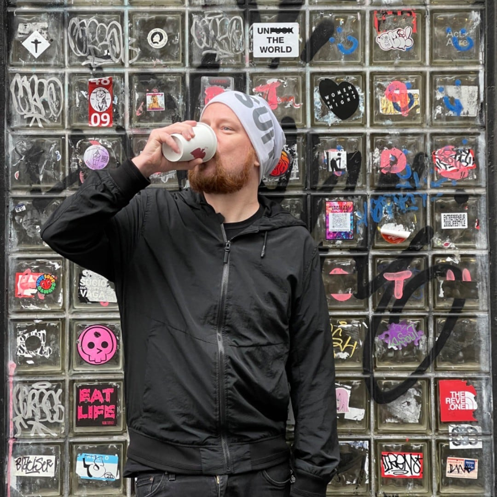

# Hello!

I'm James Dennis. I make ideas real, whether through code, music, or writing. 

I have built data pipelines & backends for Spotify, a payments gateway and deployment tooling for Venmo, and ML pipelines that processed hundreds of terabytes of video for HBOMax. I developed a mobile player for VHX (_acquired by Vimeo_) and an event admission system for The Whitney Museum's biennial. While doing DARPA funded mental health research with Qntfy, I designed and built out a system that collected data from every major social network and fitness tracker.

At UPenn, where I currently am, I have contributed to the design of their new AI degree programs, built AI tools to support students and professors, helped construct Coursera lessons, published research with [Chris Callison-Burch](https://www.cis.upenn.edu/~ccb/), and I will be mentoring students in [Wharton's GenAI Studio](https://gail.wharton.upenn.edu/gen-ai-studio/) this fall.

Through J2 Labs, my former consultancy, I built many backends and infrastructures for numerous smaller companies, some acquired, others that ran their course as early stage companies do.

My open source creations include [Schematics](http://github.com/schematics/schematics) (a type system for Python focused on human data types), [Brubeck](https://github.com/j2labs/brubeck) (a concurrent server framework), and [Micro Army](https://github.com/jmsdnns/microarmy) (a distributed load testing tool). I'm currently rewriting Micro Army in Rust as [Killa Beez](https://github.com/jmsdnns/killabeez). Users of my open source projects include Apple, Huffington Post, Warby Parker, and Criterion Collection.

I co-founded several tech communities including [Hack && Tell](https://hackandtell.org), Brooklyn Swift, and Dumbo Tech Breakfast. I studied computer science at Northeastern University and I was in the first batch at [Recurse Center](https://recurse.com).

 

