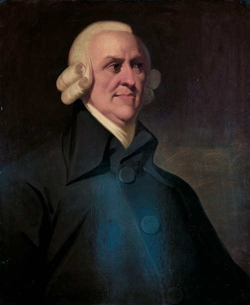
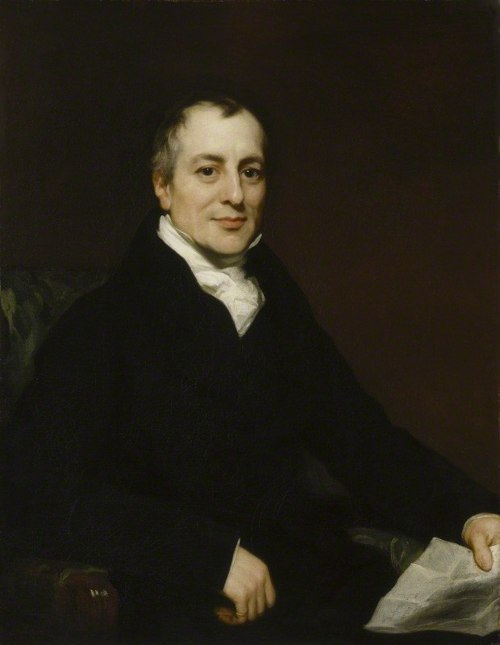
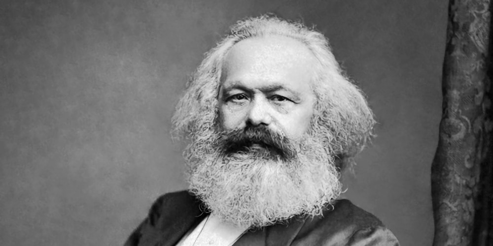

It's hard to believe, but there was once a time when Capitalism didn't feel inevitable. This has happened multiple times, actually. When considered across several centuries, arguments can be made that material social advancement happens as long waves of amazing creativity and productivity with the newest tech for some era, followed by more calm periods where society finds the new tech boring and ordinary, and society ebbs and flows between the two over time. Consider this flow of human creativity from the last 200 years: the industrial revolution, the steam engine & railways, electricity & steel, automobiles & oil, and computers & telecommunications.

Arguments for capitalism often include praising its dynamism and ability to make people rich. History also shows a persistent tendency towards groups accumulating enough power that they are outside accountability, including democratic accountability. Folks alive today already know capitalism produces wealth and they're also familiar with wealth operating outside democratic accountability. Schumpeter tells us that this too should come in waves. Wealth accumulates until it has enough control to strangle society's belief in the future and it's at that point when revolution feels around the corner.

To understand Schumpeter, we must put ourselves in the shoes of someone who left Germany for the US in the 1920's, witnessed the wild wealth of those infamous roaring 20's, then witnessed the great depression, followed by the build up for World War II. And somewhere along the way, he studied Marx. Schumpeter is a capitalist, to be clear, but he also felt like Marx nailed his critique. He then wondered _if Marx was right, where was his predicted Revolution?_ Regardless of where you lie on the political spectrum, this is a very interesting question.

What makes Schumpeter unique is that he reframes Marx, in the perspective of a capitalist, and describes entrepreneurial innovation as though it is the capitalist form of the missing Marxian revolution. Instead of a violent uprising, new companies instead eat the old, creating new generations of wealth that break apart whatever entrenched power came before them. He called it _creative destruction_.

I want to trace a line from Adam Smith through David Ricardo to Marx, and then to Schumpeter.

