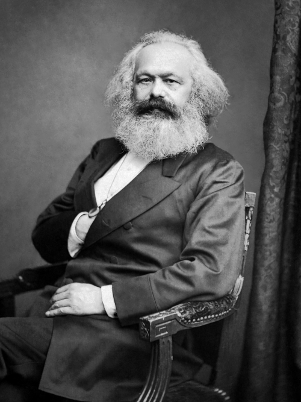

It's hard to believe, but there was a time when Capitalism didn't feel inevitable. Multiple times, actually. When considered across several centuries, arguments can be made that material social advancement happens as long waves of amazing things with tech, followed by more calm periods where society finds the new tech boring and ordinary. Creative folks get bored during the calm periods and create the next long term wave. Schumpeter's ideas are the foundation of these arguments.

To understand Schumpeter, we must put ourselves in the shoes of someone who left Germany for the US in the 1920's and witnessed the wild wealth of the roaring 20's, then the great depression, and then the build up for World War II. And, at somewhere along the way, he studied Marx. Schumpeter is a capitalist, to be clear, but he also felt like Marx nailed his critique. He then wondered _if Marx was right, why didn't a place like the US ever have the predicted Marxian Revolution?_ Regardless of where you lie on the political spectrum, this is a very interesting question.

Arguments for capitalism often include praising its dynamism and wealth-creation power. History also shows a persistent tendency towards groups accumulating enough power that they are outside democratic accountability. Folks alive today already know capitalism produces wealth. Schumpeter wondered about what happens when a company is so powerful that they can easily squash anyone that attempts to compete? Schumpeter essentially reframes what Marx said into the perspective of a capitalist. He acknowledges the dangers Marx saw and responds by saying _this will sound crazy, but I have a theory that all that stuff is actually manageable_.

A key detail for Schumpeter is that he believed any capitalist society will eventually eat itself. He believed capitalism's greatest threat was not its failures, but its success. Modern critiques of capitalism are full of detail about what happens when capitalism goes wrong, and Schumpeter would probably agree with them. He'd then try to solve the problems they described. That's what makes him a capitalist, ultimately, even though his book also says socialism is inevitable. He wanted to slow down socialism's arrival so that the pressure cooker of capitalism keeps its creative momentum going as long as possible.

I want to trace a line from Adam Smith through David Ricardo to Marx, and then to Schumpeter's concept of _creative destruction_, an idea so important Schumpeter is the third most cited economist, after both Marx and Smith.

# Classical Economics: Smith & Ricardo

## Adam Smith

Any story about capitalism has to start with Adam Smith's _The Wealth of Nations_, published in 1776. Smith observed something that seems obvious now but was genuinely revolutionary: when workers specialize in narrow tasks, productivity explodes. His famous pin factory example showed that ten workers dividing the labor of pin-making could produce thousands of pins per day, while a single worker doing everything might make one. This division of labor, Smith argued, was the engine of prosperity.

Smith's deeper insight was that this productive system didn't require a central planner. Markets, through the price mechanism, could coordinate the activities of millions of self-interested individuals into something resembling social order. This is the famous "invisible hand"—not a literal force, but a metaphor for how individual pursuit of profit could, under the right conditions, serve the common good. The baker doesn't make bread out of benevolence; he makes it to earn a living. Yet we all get fed.

Crucially for our story, Smith also articulated an early version of the labor theory of value. In his telling, the "real price" of everything is the toil and trouble of acquiring it. Labor is the original currency, the foundation upon which exchange value rests. This idea—that labor is the source of value—would become the cornerstone of classical economics and, eventually, the weapon Marx would turn against capitalism itself.

Smith was fundamentally optimistic. He saw capitalism as a system that could generate unprecedented wealth, lifting society out of poverty through the accumulated gains of commerce and specialization. The system had a direction, and that direction was up.

## David Ricardo

David Ricardo, writing a generation after Smith, took the labor theory of value and sharpened it into something more precise and more troubling. For Ricardo, the value of a commodity was determined by the quantity of labor required to produce it, including the labor embodied in the tools and materials used. This wasn't just a description; it was a theory that implied something about how the economic pie gets divided.

Ricardo was particularly interested in rent—the income that flows to landowners simply by virtue of owning land. His theory of differential rent showed that as population grows and less fertile land comes under cultivation, the owners of better land capture increasing shares of national income without doing anything productive. They profit from scarcity, not contribution. This was a pointed critique of the landed aristocracy, but it also introduced a disturbing dynamic into classical economics: the idea that one class could gain at another's expense through the structure of the system itself.

Even more significant was Ricardo's analysis of profit rates. He argued that as the economy matured, the rate of profit would tend to fall. Wages would be pushed toward subsistence (the "iron law of wages"), rents would rise, and profits—the engine of capital accumulation—would be squeezed. The endpoint was what Ricardo called the "stationary state": an economy that had exhausted its capacity for growth, stuck in a kind of equilibrium without dynamism.

Ricardo didn't frame this as a moral critique. He was trying to describe the system's logic, not condemn it. But his analysis contained tensions that couldn't be easily resolved within his framework. If classes have competing interests over a fixed pie, and if the system tends toward stagnation, what prevents conflict from tearing it apart?

## Bridge to Marx

Ricardo handed Marx a loaded gun. The labor theory of value, the analysis of class interests, the tendency toward crisis and stagnation—all of this raw material sat waiting for someone willing to draw more radical conclusions. Ricardo saw tensions in capitalism but remained committed to finding ways to manage them. Marx would ask: what if the tensions aren't bugs but features? What if the system's internal logic points not toward equilibrium but toward its own destruction?

# Marx's Critique and Predicted Collapse

## Theoretical Foundations

Marx took Ricardo's labor theory of value and transformed it into an indictment. If labor is the source of all value, Marx asked, then what exactly is profit? His answer was surplus value: the difference between what workers produce and what they're paid. When a factory worker creates goods worth $100 but receives $50 in wages, the remaining $50 doesn't disappear—it flows to the capitalist as profit. This isn't incidental to capitalism; it's the mechanism by which capitalism operates.

Marx embedded this economic analysis within a broader theory of history. Historical materialism holds that the fundamental driver of social change is the mode of production—the way a society organizes labor and resources. Feudalism gave way to capitalism not because of new ideas or moral progress, but because the productive forces outgrew feudal relations. The rising bourgeoisie needed markets, wage labor, and capital accumulation; feudal lords standing in the way were swept aside. Marx believed capitalism would suffer the same fate. Its own productive forces would eventually strain against the relations of private ownership, creating pressure that only revolution could release.

Exploitation, in Marx's framework, isn't a moral failing of individual capitalists. It's a structural feature. A capitalist who refuses to extract surplus value won't remain a capitalist for long—competition will destroy him. The system compels behavior; individual virtue is irrelevant.

## Capitalism's Internal Contradictions

Marx identified several mechanisms by which capitalism would undermine itself. The first was the falling rate of profit. As capitalists compete, they invest in labor-saving machinery. But if labor is the source of surplus value, then replacing workers with machines reduces the very basis of profit. Individual capitalists pursue mechanization to gain competitive advantage; collectively, they erode their own returns. This is a contradiction in the strict sense: rational behavior at the individual level produces irrational outcomes at the systemic level.

The second mechanism was the concentration of capital. Competition doesn't produce perpetual competition—it produces winners and losers. Over time, capital accumulates in fewer hands. Small producers are crushed or absorbed by larger ones. The endpoint isn't the free market of economic textbooks but monopoly and oligopoly, a few giant firms dominating entire industries. This concentration of economic power, Marx argued, would create the political conditions for its own overthrow.

Third, Marx predicted the immiseration of the proletariat. As labor-saving technology spreads and the "reserve army of the unemployed" grows, workers lose bargaining power. Wages fall toward subsistence; working conditions deteriorate; the gap between capitalists and workers widens into a chasm. The very productivity gains that create wealth for owners create misery for those who actually do the work.

Finally, capitalism's boom-bust cycles weren't accidents to be managed but symptoms of systemic instability. Overproduction leads to gluts, gluts lead to crashes, crashes destroy capital and employment, and the cycle begins again—each time, Marx believed, more severe than the last.

## Predicted Outcome

These contradictions, Marx argued, would eventually prove fatal. Capitalism would destroy itself through its own logic. The concentration of capital would create a bourgeoisie small enough to overthrow. The immiseration of workers would create a proletariat desperate enough to revolt. The recurring crises would demonstrate the system's irrationality to all who suffered through them.

The revolution, in Marx's telling, was not merely desirable but inevitable. It was written into the structure of capitalism itself, a destination the system was traveling toward whether anyone wanted it or not. The role of communists was not to invent a revolution but to recognize one already in motion and help it along.

This teleological character is crucial for understanding Schumpeter's response. Marx wasn't offering a policy critique or a reform agenda. He was claiming to have discovered the laws of historical motion. Capitalism had a trajectory, and that trajectory ended in its replacement by socialism. Any defense of capitalism would have to grapple with this claim.

# Manic Pixie Capitalism Never Dies

## Empirical Challenge

Here's the awkward part for Marxists: the revolution kept not happening. Marx expected it in his lifetime. His followers expected it after World War I. By the mid-20th century, capitalism had survived two world wars, a global depression, and the challenge of actually existing socialism—and emerged stronger. More awkwardly still, the working class in advanced capitalist countries had experienced rising living standards, not immiseration. They had cars, televisions, and suburbs. They seemed more interested in consumer goods than class consciousness.

This didn't mean capitalism was without problems. Inequality persisted; crises continued; exploitation was real. But the specific prediction—that capitalism would collapse under the weight of its contradictions and be replaced by socialism through revolutionary action—had not materialized. Something in the model was wrong, or at least incomplete.

## Theoretical Gap

Classical economics and Marxism, despite their differences, shared a peculiar limitation: neither had a good theory of sustained economic transformation. Classical economists imagined economies tending toward equilibrium—balanced, static, at rest. Ricardo's stationary state was the logical endpoint of his system. Marx predicted a different destination but still imagined an endpoint: the final crisis, the revolution, the transition to a new mode of production.

What neither framework could explain was capitalism's apparent capacity for reinvention. The system kept changing. New industries emerged; old ones disappeared; technologies transformed daily life within single lifetimes. The capitalism of 1950 was almost unrecognizable compared to the capitalism of 1850—and yet it was still, recognizably, capitalism. The system had a dynamism that didn't fit equilibrium models or deterministic collapse narratives.

## Question Posed

This gap demanded an explanation. If capitalism wasn't stable (as classical equilibrium models implied), and if it also wasn't collapsing (as Marx predicted), what was it doing? What mechanism allowed the system to transform itself without either settling into rest or tearing itself apart? And if such a mechanism existed, what did it imply about capitalism's future—and about the revolutionary hopes invested in its demise?

# Schumpeter's Innovation Theory

## The Entrepreneur as Historical Agent

Schumpeter's answer begins with a figure conspicuously absent from both classical economics and Marxist theory: the entrepreneur. This isn't the capitalist—the owner of capital, the extractor of surplus value. It's not the manager—the administrator who keeps existing operations running smoothly. The entrepreneur is something else entirely: the agent of novelty, the person who introduces "new combinations" of productive means into the economic system.

What does this mean concretely? Schumpeter identified five types of new combinations: introducing a new good, introducing a new method of production, opening a new market, conquering a new source of supply, and reorganizing an industry. The entrepreneur is the one who sees these possibilities and acts on them—not because the market signals their profitability, but before that signal exists.

This is crucial. In equilibrium economics, prices coordinate behavior; everyone responds to incentives already present in the system. The entrepreneur, by contrast, acts on opportunities that the market hasn't yet recognized. They create the new reality and then profit from it. Henry Ford didn't respond to consumer demand for affordable automobiles—he created that demand by making the Model T. Steve Jobs didn't respond to market signals for smartphones—he created a market that didn't previously exist.

Schumpeter was fascinated by the psychology of such figures. What motivates them? Not merely profit, he argued—or not only profit. There's a will to conquer, the impulse to prove superiority, the joy of creation and getting things done. Entrepreneurs are driven by something beyond rational calculation; they're a particular human type, recurring throughout history, who find satisfaction in the act of building something new.

This matters because it offers an alternative to Marx's class-based account of historical agency. For Marx, change comes from the proletariat—a class defined by its position in the relations of production, driven to revolution by collective interest. For Schumpeter, change comes from individuals who don't fit neatly into class categories at all. They can come from anywhere. What defines them is function, not origin.

## Creative Destruction

Schumpeter's most famous concept names the process by which entrepreneurial innovation reshapes the economy: creative destruction. The steam engine doesn't just create the railroad industry; it destroys the canal industry. The automobile doesn't just create new possibilities for transportation; it obliterates the horse-and-buggy economy—the farriers, the stable hands, the carriage makers, all of it. Digital photography didn't just improve picture-taking; it killed Kodak.

This destruction isn't incidental. It's the mechanism by which capitalism transforms itself. The new doesn't simply add to the old; it displaces it. Resources flow from declining sectors to rising ones. Fortunes are made and lost. Skills become obsolete. Entire ways of life disappear.

Schumpeter saw this process operating in waves. Drawing on the work of Nikolai Kondratieff, he identified long cycles of roughly 50 years, each organized around a cluster of related innovations. The first industrial revolution (textiles, iron, water power), the railway age, the era of steel and electricity, the automobile age—each wave transformed the economy, generated enormous profits for early movers, matured, and eventually gave way to the next.

Within each wave, the pattern recurs: entrepreneurial innovation, followed by a swarm of imitators, followed by competition that erodes profits, followed by stagnation—until the next round of innovations triggers a new wave. The system never reaches equilibrium; it's perpetually disrupted and reconstituted.

This reframes capitalism's instability. For Marx, crises were symptoms of fatal contradictions. For Schumpeter, they're the rhythm of transformation. The destruction is real—people lose jobs, industries vanish, communities are hollowed out—but it's also the flip side of creation. The same process that destroys also renews.

## Schumpeter as Capitalist Marx

The parallels between Schumpeter and Marx are striking enough that calling Schumpeter "the Marx of capitalism" isn't merely clever branding. Both thinkers rejected the static equilibrium models of mainstream economics. Both understood capitalism as a historical process, not a natural state—something with a past and, crucially, a future that might look very different. Both recognized that capitalism proceeds through destruction, tearing down existing structures as it advances.

But where Marx saw the destruction as terminal—the contradictions that would bring the system down—Schumpeter saw it as regenerative. The old is destroyed precisely so the new can emerge. Capitalism doesn't collapse under the weight of its contradictions; it metabolizes them. The falling rate of profit isn't a death spiral; it's the signal for entrepreneurial innovation that restores profitability in new sectors. Concentration of capital isn't the prelude to monopoly stagnation; it's a temporary consolidation before the next wave of disruptive newcomers.

The difference in agency is equally fundamental. Marx's protagonist is a class—the proletariat, defined by its relationship to the means of production, driven to collective action by shared interest. Schumpeter's protagonist is an individual type—the entrepreneur, defined by function rather than position, driven by psychology as much as interest. The revolution, for Marx, is collective and political. For Schumpeter, it's individual and economic: a thousand small revolutions, each entrepreneur overturning some portion of the existing order.

This isn't a complete rebuttal of Marx. Schumpeter took Marx seriously in a way few capitalist economists did. He agreed that capitalism was transformative and destructive, that it created winners and losers, that it generated systemic pressures. He simply offered a different account of where those pressures led.

## Schumpeter's Own Pessimism

Here's the twist: Schumpeter, defender of capitalism's creative dynamism, also predicted its demise. His 1942 book _Capitalism, Socialism and Democracy_ argued that capitalism would eventually give way to socialism—not through revolutionary crisis but through its own success.

The mechanism was bureaucratization and cultural hostility. As firms grow larger, innovation becomes routinized. The heroic entrepreneur gives way to the corporate R&D department; the individual risk-taker is replaced by committees and procedures. The creative destruction that defines capitalism gets managed, dampened, controlled. Meanwhile, capitalism creates a class of intellectuals with the education to criticize and the leisure to organize that criticism. These intellectuals, Schumpeter believed, would corrode capitalism's cultural legitimacy, undermining the value systems that sustained entrepreneurial dynamism.

The endpoint is a kind of soft socialism: not revolutionary expropriation but the gradual expansion of state management over an economy too bureaucratized to resist. Capitalism wins and, in winning, destroys the conditions for its own continuation.

This pessimism is often overlooked by Schumpeter's modern admirers in Silicon Valley, who cite creative destruction as justification for disruption. But Schumpeter himself saw disruption as a phase, not a permanent condition. The question wasn't whether capitalism would survive but how long it would retain its transformative capacity before settling into administered stagnation.

# Conclusion

The line from Smith through Ricardo to Marx and finally to Schumpeter traces an evolving understanding of capitalism's nature. Smith saw a system of wealth creation, coordinated by markets, tending toward prosperity. Ricardo introduced tensions: competing class interests, diminishing returns, the threat of stagnation. Marx transformed those tensions into contradictions, arguing that capitalism's logic led inexorably to collapse and revolutionary transformation.

Schumpeter took Marx's systemic seriousness while rejecting his conclusions. Yes, capitalism destroys. Yes, it creates crises, displaces workers, concentrates power. But destruction is also creation; crisis is also renewal; the system's instability is also its dynamism. The entrepreneur—not the proletariat—is the agent of historical change, and entrepreneurial innovation allows capitalism to escape the traps Marx identified.

This framework remains remarkably relevant. The language of creative destruction permeates discussions of technology and business. Startups explicitly aim to "disrupt" incumbents. Platform economies have transformed industries from transportation to hospitality in ways Schumpeter would recognize. The Kondratieff waves he described find echoes in debates about whether we're due for a new technological revolution or stuck in a "great stagnation."

Yet Schumpeter's pessimism also resonates. The tech giants that once disrupted have themselves become incumbents, acquiring potential competitors and lobbying for regulations that protect their positions. The venture capital industry, supposedly funding the entrepreneurs who drive creative destruction, increasingly resembles the bureaucratic capitalism Schumpeter feared. The question of whether capitalism retains its transformative capacity—or whether it has settled into the administered stagnation Schumpeter predicted—remains open.

Reading Schumpeter today offers neither comfort nor condemnation. It offers a lens: a way of seeing capitalism as neither permanently stable nor inevitably doomed, but as a system defined by transformation, subject to phases of dynamism and stagnation, never finished, always becoming something else. Whether that something else is better or worse, and whether we have any say in the matter, are questions Schumpeter leaves us to answer for ourselves.
