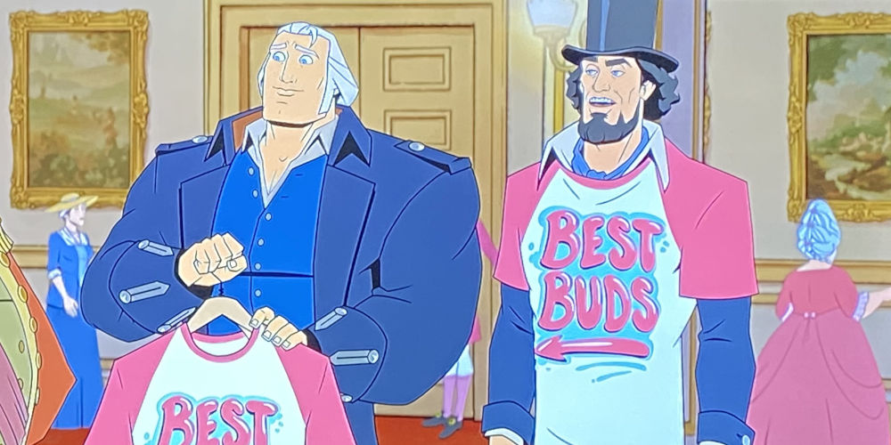

The main thing to understand, before I go into detail, is that the Declaration of Independence is one of the founding documents, but it did not create a nation. Some of the colonists got together and wrote a historically eloquent letter to King George III that basically said, "_ayyyy fuck your king! BING BONG_"

The country's _real_ birthday is December 1st, 1774, before [the shot heard around the world](https://en.wikipedia.org/wiki/Shot_heard_round_the_world), and before July 4th, 1776. Ben Franklin invented the idea of a United States, first proposing it back in 1754, and he signed The Constitution over 30 years later in 1787.

Perhaps the best part of Franklin's story is the way his love of bending the truth for social good somehow gave him the skills to eventually see his idea realized in the form of a country.

# The Noble Rascal

> Fart for freedom, fart for liberty - and fart proudly.
> 
> -- Ben Franklin

He was 16 in 1722 when he first published letters in his brother's newspaper, pretending to be a middle-aged widow named [Silence Dogood](https://en.wikipedia.org/wiki/Silence_Dogood). Ms. Dogood made people laugh while encouraging them to _do good_ and be more fair minded. For example, he explores feminism [in the fifth Dogood letter](https://thehistoryjunkie.com/silence-dogood-letter-5/) by criticizing men who complained about their wives by pointing out that those men were guilty of all the same things, but worse! He questions whether or not people who pretend to be religious do more harm to society than the openly profane in [the tenth Dogood letter](https://thehistoryjunkie.com/silence-dogood-letter-10/).

The Dogood letters are incredible, not just as the work of a 16 year old, but as a demonstration of Franklin's interest in convincing people to treat each other well and support each other. Amusingly, his brother _really_ wasn't pleased to learn what happened so Benjamin moves from Boston to Philadelphia to get away.

At 25 he started the [Library Company of Philadelphia](https://en.wikipedia.org/wiki/Library_Company_of_Philadelphia) to create a collective that would pool money to buy and share books. At 26, he created another persona, "Poor Richard", and published [Poor Richard's Almanack](https://en.wikipedia.org/wiki/Poor_Richard%27s_Almanack), which he filled with humor and wisdom about how to live, similar to Ms. Dogood. At 30 he learned of a fire that started on a docked boat and spread across the dock to three houses before it was put out, so he started the first volunteer fire department, the [Union Fire Company](https://en.wikipedia.org/wiki/Union_Fire_Company). At 43 he founds the fifth oldest institution of higher education in the US, the [University of Pennsylvania](https://en.wikipedia.org/wiki/University_of_Pennsylvania).

The quote above, about farting proudly, is from an essay he wrote in 1781 to the Royal Academy of Brussels while he was the US ambassador to France, called "[A Letter to a Royal Academy about farting](https://en.wikipedia.org/wiki/Fart_Proudly)". He believed the academic societies of Europe were pretentious and too focused on stuff that didn't really matter. He made this point by writing an essay the urged them to research methods of improving the smell of farts. He claims this is important because if farts smell bad, humans will hold them in to be polite, which "not only gives frequently great present pain, but occasions future diseases." I mean... that's 

That raccoon hat in the pic above..? He only wore it in Europe. He liked to make himself fit the european stereotype of him as the humble, backwoods genius that touched a lightning bolt, even though he never wore the hat at home and lived in cities for most of his life.

# Iroquois Confederacy

Franklin ran a newspaper in Philadelphia, called [The Pennsylvania Gazette](https://en.wikipedia.org/wiki/The_Pennsylvania_Gazette). One of his jobs was to print to treaties from different conferences, including ones with native tribes, and in one of those treaties was a speech by a leader named [Canasatego](https://en.wikipedia.org/wiki/Canasatego) that said, "we the Iroqouis have figured out Union, it's time of you the Colonists to do so also." His curiosity about what that meant exposed him to the [Iroquois Confederacy](https://en.wikipedia.org/wiki/Iroquois#Iroquois_Confederacy).

The Iroquois system had a _Tadodaho_, similar to a President, and there was a council of delegates. The fascinating thing about this system is that it succeeded so well in stopping conflict between all member tribes, who instead cooperated against threats from competing tribes. Each tribe maintained its own identity and moral compass and they would use the Iroquois system for resolving disputes whenever they arose, instead of resorting to violence.

 
_Flag for the Iroquois Confederacy, represented as a recreation of the Hiawatha Belt, which depicts the five original tribes and their interconnections._

For Franklin, a civic minded person that likes to bring others together for the common good, learning about the Iroquois was life changing. It exposed him to the idea that several independent nations could be loosely knit into a larger government without giving up their independence.

# The Albany Plan

By July 1754, the [French and Indian War](https://en.wikipedia.org/wiki/French_and_Indian_War) had broken out. This is a war where the French were vastly outnumbered by the Brits, so they teamed up with Native tribes to fight England together. The colonists were concerned about being attacked by the French in Canada and made plans for a conference to discuss defense, called [The Albany Congress](https://en.wikipedia.org/wiki/Albany_Congress).

Inspired by the Iroquois, Franklin proposes an idea for a union of colonies and explains that it would put the colonies "under one government as far as might be necessary for defense". To bolster support, he published a political cartoon with the words _Join, or Die_.

 
_Join, or Die. a 1754 political cartoon by Benjamin Franklin published in The Pennsylvania Gazette in Philadelphia, addresses the disunity of the Thirteen Colonies during the French and Indian War._

In spite of the great points Franklin made, the plan was rejected. Dismayed, he wrote _The colonial assemblies and most of the people were narrowly provincial in outlook, mutually jealous, and suspicious of any central taxing authority._ Classic America.

# Continental Association

After two years, the French and Indian War escalates into [The Seven Years War](https://en.wikipedia.org/wiki/Seven_Years%27_War), which is still France vs England, but several other countries have joined in and aligned themselves with one of them. This war had so many countries involved that some historians say it was [the first global war](https://www.youtube.com/watch?v=blUr5AuRXjw&t=58s). The war ends in 1763 with British victory and they waste no time locking down control of their empire, including the colonies.

To pay for the defense of the colonies, the Brits decide to tax the colonists and pass the [Stamp Act of 1765](https://en.wikipedia.org/wiki/Stamp_Act_1765). In case you're unfamiliar with how the colonies felt about being taxed, let's just say they **really** didn't like it. First, the colonists didn't fear attack from the French since the end of the war, so paying for defenses didn't seem necessary, and second, they felt England just wanted to assert its power over the colonies. British authorities made things worse when they told the colonists they were subjects of the English Crown, yet they were not British, and thus had no right to be represented in the British House of Commons. The phrase "[no taxation without representation](https://en.wikipedia.org/wiki/No_taxation_without_representation)" emerges, but Franklin can't stand it. He believed representation in the House of Commons would be worthless and was not worth fighting for.

George Washington had been a soldier in the British Army during the French and Indian War. He grew frustrated when Virginians were paid less than British officiers. Soon after joining the army was restructured and he was demoted, so he quit. He rejoins some months later as an unpaid aid to General Braddock, commander-in-chief of the thirteen colonies, whom Washington viewed as a poor general of disastrous consequence, but GW proves himself enough to become commander in chief of all Virginia Forces, where he still wasn't paid as well as British officers. He resigns in 1759 to become a farmer, and sure enough, he found the British insisted on paying him less than others. By 1769, he finally ran out of patience and became part of the revolution.

 
_The earliest known portrait of George Washington_

John Adams was also becoming radicalized by these events. He publishes his first political essay, [A Dissertation on the Canon and Feudal Law](https://founders.archives.gov/documents/Adams/06-01-02-0052-0005), attacking the Brits for depriving the colonists of two rights guaranteed to Englishmen by the Magna Carta: _1.) the right to be taxed only by consent, and 2.) the right to be tried only by a jury of one's peers_. Adams becomes a force for the rule of law and questions why the colonists, controlled by Britain, aren't equal before the law with Englishmen, attacking the very foundation of the English system.

 
_A picture of John Adams [from 2008](https://www.imdb.com/title/tt0472027/)_

Samuel Adams, John's cousin, takes a wilder route. He was bootlegger that was good at avoiding British oversight, letting them avoid paying taxes, letting him undercut legal markets for the same goods. The Brits can't seem to stop him, so they decide to join him, and set their prices so low that Samuel becomes the one who can't compete. Samuel reacts by organizing the [Boston Tea Party](https://en.wikipedia.org/wiki/Boston_Tea_Party), where he and members of the Sons Of Liberty dress as natives, sneak onto English boats, and then toss 342 chests of tea into the water.

 
_"Boston Tea Party.", The History of North America. London: E. Newberry, 1789_

Needless to say, the English didn't like that. Nor did they like the growing aggression from colonists. They pass a series of laws meant restructure how they administer the colonies, and the colonists, not mincing any words, called them the [Intolerable Acts](https://en.wikipedia.org/wiki/Intolerable_Acts). The colonists organize a confederence, the [First Continental Congress](https://en.wikipedia.org/wiki/First_Continental_Congress), to determine what to do. Some attendees knew about Franklin's Albany Plan (_wonder how that happened_) and they propose a union, called the [Continental Association](https://en.wikipedia.org/wiki/Continental_Association), and it's purpose would be to cancel Britain in a group boycott of British imports. Their goal was to exert economic pressure on Britain, forcing their hand into addressing their grievances. For them, this was a peaceful approach, as it attempts to use economics before violence.

Franklin had been living in England since 1757, and he was still there in 1774, so he missed the confederence, but he understood what it meant that the colonies had formed a union. He had thought about it for 20 years by then. He moved back in 1775 and writes the [Articles of Confederation and Perpetual Union Between the States](hhttps://founders.archives.gov/documents/Franklin/01-22-02-0069) that same year, which become the v2.0 of the Union by the [Second Continental Congress](https://en.wikipedia.org/wiki/Second_Continental_Congress) in 1777.

# The First Union

The Continental Association is first time the colonies expressed a collective will to work together in the form of a legal document. It was published October 20, 1774 but went into effect December 1, 1774. The US does not observe December 1 as a national holiday, though it should. It is barely in the cultural memory at all.

We are, however, lucky that Abraham Lincoln understood it this way and memorialized awareness of it in his first inaugural address in 1861. Lincoln credits the Association as the origin of the union, which is matured by the Delcaration, the Articles of Confederation, creating union v2.0, and then matured again by the Constitution, which created union v3.0.

The way he frames it is quite beautiful.

> Descending from these general principles, we find the proposition that in legal contemplation the Union is perpetual confirmed by the history of the Union itself. The Union is much older than the Constitution. It was formed, in fact, by the Articles of Association in 1774. It was matured and continued by the Declaration of Independence in 1776. It was further matured, and the faith of all the then thirteen States expressly plighted and engaged that it should be perpetual, by the Articles of Confederation in 1778. And finally, in 1787, one of the declared objects for ordaining and establishing the Constitution was "to form a more perfect Union."
>
> -- [First Inaugural Address of Abraham Lincoln](https://avalon.law.yale.edu/19th_century/lincoln1.asp)

 
_A picture of Abraham Lincoln hanging out with his best friend George Washington [from 2021](https://www.netflix.com/title/80189631)_

Some say Lincoln gave us union v4.0, and I see it this way too. The 13th, 14th, and 15th clauses made clear things that were previously ambugious in v3. In particular, they made clear that everyone is equal before the law.

# What Is July 4th Then?

July 4th is the day the colonists said, "_fuck this shit!_", and made it clear they were done with England.

The declaration itself is a fascinating thing to read, especially after the first two paragraphs. It reads like a conspiracy theory about how awful King George III is. Some truly excellent propaganda for riling people up, though be aware a modern perspective will find it quite offensive towards non-whites.

> _King George turned me into a newt!_
>
> -- The Delcaration of Independence, _after [it got bettuh](https://www.youtube.com/watch?v=ZB5ig6vpQug)_

The thing to understand about the creation of the US is that it could not have happened without substantial public support. Ben Franklin was there, of course, with a lifetime of experience, ready to rile up the hearts and minds of the colonies in support of the cause. He was the editor of the Declaration of Independence, largely written by Thomas Jefferson, but overseen by Franklin.

Sensing a kindred spirit in Jefferson, he kept most of what Jefferson wrote, but made a crucial change. Jefferson wrote "We hold these truths to be _sacred and undeniable_", but Franklin, knowing the Brits would immediately deny those truths, made the claim more bold, asserting it as truth regardless of what anyone thinks. Franklin's version said "We hold these truths to be _self-evident_".

The correct way to think about July 4th is that it is literally a US holiday that celebrates saying _fuck you!_ to authority. Doesn't get more American than that.

 
_Mr. Swanson makes the point._

# After July 4th

Franklin wastes no time building international support for the US cause. He is chosen to be ambassador to France and sets sail in October 1776, a few months after the Declaration. He knew that if anyone could take on the Brits, it would be the French, and he got to work converting them to the US cause. The height of his wily antics, in my opinion, comes next.

He got the French on-board with the US cause by repeatedly lying to French leaders about how well the war against the British was going! He told them the colonies were kicking ass left n right and he urged them to join in while English ass was still available. History books typically mention the shock of the French when they arrived in the colonies and find Washington's Army in poor health, with many barely clothed at all, but hey don't usually say _why_ they were so shocked. The truth here is classic Franklin. The French Army would already be fighting by the time France learned of it, and Franklin could surely find a way to talk himself out of that.

The colonists get their country when the British sign the Treaty of Ghent in 1783 and Franklin is at the Constitutional Convention to see v3 of his idea become a thing, matured by innovations from the next generation of leaders.

> Fart proudly.
>
> -- Ben Franklin
