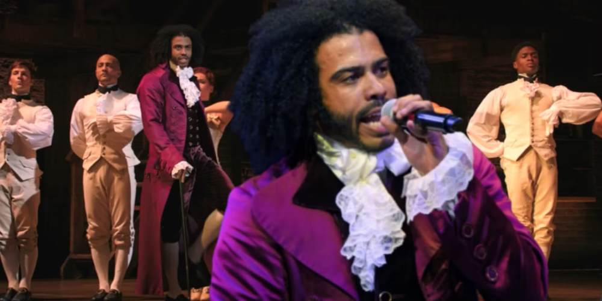

People paying attention to politics in the US have probably come across the term _virtue signaling_. It is usually used to mock those that expect others to live for a purpose higher than simply pursuing one's own self-interest. Folks have claimed it is virtue signaling, instead of virtuous, to resist racism, homophobia, sexism. Instead of adjusting to be more virtuous, these folks want to resist letting anyone call them out for bad behavior. They probably see themselves as patriotic too, without realizing they are at odds with the nation’s founding principles.

The founders would be horrified by resistance to virtue. They might even call it _corruption signaling_. All of them strived to claim themselves as virtuous, though their definitions of virtue varied. George Washington makes a great example. He gave up power when he gave up his army after beating Britain and King George III, the king of Britain at the time, was so shocked that he said, “well if he did that, he’d be the greatest man in the world!”

Striving to be virtuous represents an attempt to counter one of the few problems governments face that cannot be solved with law. It represents something that must be learned and maintained by a people that governs itself. It represents an attempt to build a government and a society that chooses to resist corruption.

# Sudden Radical Change

Prior to the 2016 election, my experience of government in the US was that it seemed like it rarely got anything done and that this was fine because the people of the US were going to do whatever they want all the time anyway. We’re free to be amazing and we’re free to be awful! We’re also supposed to reconcile with each other either by sorting out our differences or by going to court.

I believe that is still roughly the core of the US, but it has been buried under people who are much more radical. It is not my goal to point the finger in this essay, but you probably know what I mean too. It has been eye opening to see how wild the radicals are willing to get.

I wondered how likely it might be that the radicals succeed in replacing the older, moderate elements of their party with more radicals. I worried about the progress they made over time in filling out their party with people who genuinely don’t want the US government anymore. I thought about how worried the founders were about corruption because it felt as though we were about to witness an extreme test of how much corruption the US system can actually resist.

# What Were They Thinking

My perspective about what was taking place was different from my friends because I had been reading history. In retrospect, I hadn't read much history yet, but I read enough to have a sense of how Madison thought about things when he designed the US government. It's a design we still use. I also understood enough to have a sense that any cynicism I had ever experienced in my life was no match for the amount of cynicism Madison packed into his design. It's genuinely impressive.

It is no surprise that one of the best minds of the revolution was cynical. On the intellectual side, it makes good sense to assume the worst. On the more personal side, Madison had several experiences that exposed him to the raw, visceral side of humans at their worst. Madison was accused of being possessed by the devil because he was epileptic and had seizures. He was in Virginia when Christians attempted to wield Virginia's government against other Christians because they followed the _wrong_ Christianity. He was young when the revolution began, but he was old enough to know humans can't be trusted with power precisely because they'll use it. Yet he also knew they'll pursue it anyway.

The most impactful breakthrough I had while trying to wrap my head around the way he thought came when I realized Madison designed the government to assume everyone involved is the worst person of all time. He, if anyone, would've considered something like what's happening in 2016 and he would've done everything he could to add failsafes. From this starting point we can understand the rest.

First, get a new government started by articulating the gist of how the system operates. Then provide 10 laws, to make it clear what isn't allowed. Have everyone break out into subgroups, called states, and do the same thing for each state. If anything is missing, add it or let the states add it. It is crucial that this government is also difficult to change. Change must only be possible when an enormous amount of people agree about how to change. It can't be clear if the federal gov or state govs have more power. Instead, we'll call it _a happy ambiguity_ which can flex towards either side when the people preferences want that. This design starts with almost no laws and it resists change, in effect making it a government that maximizes and preserves freedom.

I mean... who thinks like that?! Who builds a useless government on purpose?!

The productive cynicism of James Madison is at its best when he argues in Federalist 10 that this model can scale indefinitely because it becomes harder to find enough agreement from everyone involved to change the government into something more corrupt and less likely to serve its people. Worst case scenario the government just doesn't change until the people can reconcile with each other enough to have the necessary votes for doing anything.

The amusing thing about a government that does nothing by default is that the intended user experience is for everyone involved to be frustrated all the time and to feel like the government rarely ever does anything. Madison would say that's the point. I want to think he'd also raise an eye brow and say, "_why would anyone want this job?_"

# Blunting Tyranny

The founders didn't trust each other. From Ben Franklin's perspective, it took all the way from 1752, when he first brought up his idea, in Albany, NY, for a union of the colonies, to 1774 when the colonies finally agreed there may be value in looking out for each other. It failed in 1752 because every state was too distrustful of any other state. (Typical, right?) By the constitutional convention, they all worried it was inevitable that the worst person in the world would eventually gain power. Creating a government that does nothing by default was their way of stopping potential tyrants who successfully gained power. A king can be a tyrant according to their fleeting passions, but someone elected by a democracy, who also needs hundreds of other elected people to agree with them, has a much harder go of it.

Many of the founders had studied the collapse of Rome and drew similar conclusions. They felt that corruption cannot be stopped with law. Instead, they would need the system to somehow incentivize kicking out corruption where ever it was found. Their solution was to leverage our competitive natures and turn us against each other by incentivizing everyone to root out corruption in their opponents. We can't trust people to not be corrupt, but we can trust them to use any means necessary to take down their opposition. Can't we?

> If men were angels, no government would be necessary. 
> – **James Madison**

It's not always easy to know what someone means when they say _corruption_. One way to consider it is by imagining an ideal leader, one of great virtue, and then compare leaders to that ideal. The expectations around what it means to be virtuous will change over time as new generations take over, so the pursuit of virtue in leaders is what we want. To pursue virtue is also to minimize corruption and that's exactly what we want for people in government!

I mentioned at the beginning that people who think virtue signaling is bad are at odds with the founding principles. This is because virtue is one of our safeguards against corruption. Virtue should be celebrated and we should all strive to live virtuously. To claim otherwise is to increase the odds a tyrant eventually rises to power with enough elected support to bypass the checks and balances and behave like a king. It is, after all, a problem that cannot be solved with law. We must choose to do it ourselves.

# Some Quotes

Neither the wisest constitution nor the wisest laws will secure the liberty and happiness of a people whose manners are universally corrupt.  He therefore is the truest friend of the liberty of his country who tries most to promote its virtue. 
– **Samuel Adams**

Only a virtuous people are capable of freedom. 
– **Ben Franklin**

Human rights can only be assured among a virtuous people. 
– **George Washington**

Public virtue cannot exist in a nation without private virtue, and public virtue is the only foundation of republics. 
– **John Adams**

No government can continue good but under the control of the people; and … their minds are to be informed by education what is right and what wrong; to be encouraged in habits of virtue and to be deterred from those of vice … These are the inculcations necessary to render the people a sure basis for the structure and order of government. 
– **Thomas Jefferson**

To suppose that any form of government will secure liberty or happiness without any virtue in the people, is a chimerical imaginary idea. 
– **James Madison**

A vitiated impure state of morals, a corrupted public conscience, is incompatible with freedom. 
– **Patrick Henry**
