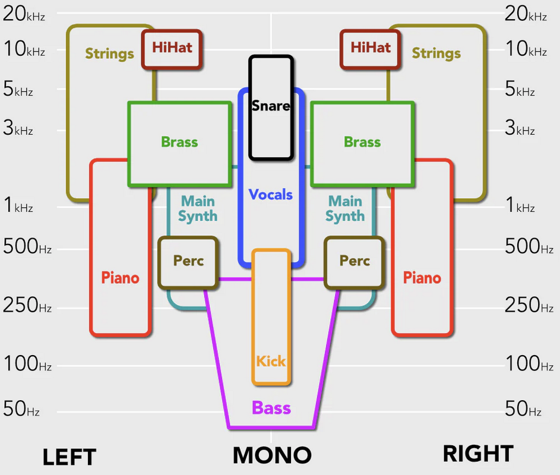
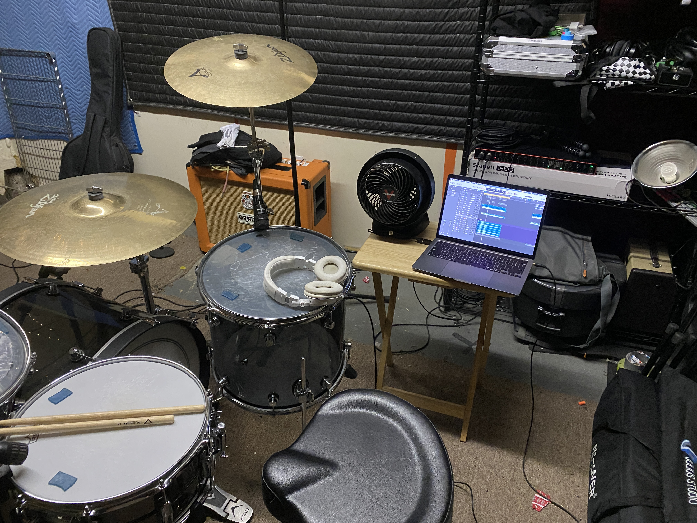

I am very pleased to say I have completed tracking for the first releases by American Food! It has taken a lot of time and effort to get through everything, especially if you consider the time I spent learning how to do things I hadn't done before.

I feel very lucky to have friends who are both excellent at music in some way and willing to give me helpful feedback. I need to thank my old friend, [Marc Allen](https://www.marcallen.design/), for helping me improve as a drummer, for giving me a good foundation of knowledge about how to record music, and for being the second drummer in one of the songs. I need to thank [Michael Schorr](https://en.wikipedia.org/wiki/Michael_Schorr) for helping me pick which drums to buy and for helping me learn how to tune them well. I need to thank [Dave Palaitis](https://www.youtube.com/watch?v=0axYTf7yyt4) for all the feedback and tips he gave me as he heard each mix, explaining how to fix issues I didn't know I had. And, I need to thank everyone on the Snowsuit Discord for the endless discussion about everything music.

# How I Started

I first recorded music with a producer back when I was 14. Marc and I had a band called Flipside, and Marc had a neighbor that recorded hardcore bands from New England in his house studio that wanted to record us too. This is where I first experienced what it means to record. By the time I'm in college, I'm playing in my 4th band, First Aid Kit, and we worked with [Greg Giorgio](https://www.discogs.com/artist/493045-Greg-Giorgio), who would also record every band I've had ever since, except for American Food.

I have always tried to pay attention to how the producers think. I wanted to understand what it means to somehow document a band's work, but I always focused _more_ on the songwriting and performance of the bands themselves. I could develop intuition about things that help a recording go well, but I couldn't say I knew why we did those things. For me, I just wanted to be an unusually easy person to work and would put in the effort to make it so. I had a sense that compressors and EQs played vital roles and that everything else might even be optional, instead of necessary. But I didn't know why!

The last band I took to Greg was [Adventure Capitalists](), and I started working on complete songs by myself shortly after the band broke up.

# Leveling Up

I came to recording with _some_ actual knowledge. I had used garageband to make demos of song ideas. I had gotten to a point where I could go from a few riffs that flow nicely together to a full sounding demo with two guitars, bass, and drums, in an hour or so. The drums took the most time because I had to model what I heard in my head, but Logic offers a software drummer that could get reasonably close to what I heard in my head. Sharing song ideas can be tricky because they're necessarily an incomplete form of what the whole band will eventually be playing, but the software drummer streamlined the process so much that I could track complete ideas soon after I first had the ideas.

Up to now, somehow going from my song sketch recordings to something that sounds professional felt like such an arduous task that I had mostly not even considered it, but Marc showed it might be something I could learn.

## Compression & EQ

I shared some of the songs with Marc and he started teaching me about compression and EQ soon after. Understanding these two made an incredible difference. The instruments all started to pop out in the mixes right away. This was the moment when I realized I was actually going to put in all the time it takes to get good at this.

Compression is the magic that stabilizes the volume of things, which is crucial for getting vocals to sound right. It's also the magic on my kick drum and snare. It's vital for bass to sit nicely in a mix. It's wild how useful it is and how much variation there is in how to do it. Further, when compression is used well, getting the volumes of everything to sit nicely in aggregate also becomes much easier.

To understand EQ, we should consider that recordings mix many instruments together in such a way that it sounds coming out of just two speakers. There is some interesting math that explains why this is even possible, but the core thing to consider is that there is a range of frequencies coming out of each speaker and you want to keep all of them from stepping on each other's toes.

Here is a great visualization, borrowed from [Mastering The Mix](https://www.masteringthemix.com/blogs/learn/decoding-the-mix-3-superstar-dj), that shows how panning and frequencies work together to make instruments stand out.

## Learning To Sing

It's also when I realized I was going to have to learn how to sing and how to record singing, and I'd need to take on the huge task of learning to record drums. I could only get away with the software drummer for so long, given I am an actual drummer. But, it would save me time until I'm ready to actually play everything myself, because I could write a bunch of music right now and worry about the recording stuff later. That is what an actual band would do anyway.

I used the time I saved _not_ recording drums (_yet_) to start learning how to sing. I did this by recording cover songs and by writing music quickly, and not thinking too hard about what the music was like. I just needed a way to practice singing and learn how to record singing. I wrote a song about bad dates I went on. I wrote a song about people getting mortgages and moving to the 'burbs. I thought of Nirvana as I sang nonsensical words. I knew I'd write serious stuff later, just not yet.

I wrote a song about my cat during this period and it'll be on Internet On The TV, one of the EPs.



## Recording Drums

As time passed, I eventually recorded 10 complete songs, most with singing, and I started to feel it might be time to finally record the songs with real drums. I had no idea how to record drums, but a friend had some gear and said I could borrow it to get started, so I did my best to set it all up and started thinking of things I could do to give me some direction in recording drums.

I thought I'd be able to record a lot of drums if I did covers of songs I already knew the drums for. I learned to play drums by playing along to playlists of my favorite drummers, so I already knew how to play a lot of stuff. I did a few Fugazi covers, a Foo Fighters cover, a Nofx cover, and a bunch more too. It wasn't hard to work out the guitars for any of these songs, so I got in a routine of tracking all of the music for a cover in a single night, and then I would take however long I felt I needed to do a good job singing the song.

I would send all of it to friends for feedback, no matter how bad a job I did, and would remind them that the performance isn't the important thing because it was just a means to get practice recording drums. Letting my desire for perfect performances go in favor of quickly interating through lessons allowed me to move very fast. I can't emphasize this enough.

I soon reached the limits of what my friend's gear could do and I leveled up my entire drumming setup. I bought a new DW kit, a new Ludwig snare, an Audix microphone kit for recording drums, and a recording interface that could send everything into my laptop. This changed everything for me. My recordings started to sound like actual recordings once I got my drumming gear in great shape.

Here is a picture of where I recorded the drums, in my old rehearsal space in Brooklyn. It served us well, but we retired it right after I finished tracking drums.

# Recording 3 EPs

I eventually reached a point where I thought I had learned enough about all the layers of producing my own music that I should organize it into an actual project, and go for it!

[American Food]() is a project where musical genre is a stylistic choice for each EP, but I felt that wouldn't be obvious unless everyone's first impression could demonstrate that. I started to think the best way to make that clear would be to release 3 EP's, each in a different genre, as my first release.

The 3 EPs are:
1. _Street Fight_, political punk rock
2. _Internet On The TV_, slower punk'ish commentary on the Internet
3. _Silent Artillery Of Time_, indie rock about the experience of getting older

From the perspective of recording, I could start with the punk EP when my skills are least developed. Then, I'd do the internet EP, which has two drummers and 7 singing voices, with the experience I gained doing the punk EP. And finally, I'd use the best developed form of my skills for the indie EP, which would require my best singing, my best drumming, and as much skill as I can gain by doing the other 2 EPs first.

So that's what I did. I tracked all of Street Fight first, including singing. I then moved on to Internet On The TV. Then I moved on to Silent Artillery Of Time. And I'm actually done! I finished this week and I've uploaded demos to soundcloud. I'm thrilled!

Up next is the part where I learn how to mix and master everything. At some point I will be done with that too, and that is when I will release all 3 EPs. 

## Demos

### Silent Artillery Of Time



### Internet On The TV



### Street Fight


