Sharing music can be a complicated task for folks who play guitars. We can easily use something like voice memos to capture us playing a guitar, but the song we have in our heads is usually big enough to include drums, a bass, and maybe a second or third guitar.  Learning to play instruments and how to write music were already huge undertakings, so it always makes sense to me when musicians don't _also_ know how to produce music.

I believe getting something that sounds pretty good, though not quite professional, is easier than people think, but only if you know some of the key tricks. And of course, these tricks are not obvious inside the lists of possible plugins you might try using. EQ, for example, can seem boring next to everything else, so there's no reason for anyone without production experience to know that it's, instead, fundamentally important when multiple instruments sit together in the recording of a song. Amps already have EQ in them, after all, so it's our nature to look there first.

In this post, I intend to provide a series of steps that anyone can use to put something together that sounds very good, as far as demos go, and can do a good job conveying a complete idea as though a whole band performed it. And, even better, we'll do it almost entirely with plugins that come built in with Logic, _except_ for GuitarRig 6, which is my favorite amp sim.

This guide assumes you already have a recording interface of some kind. I use a simple scarlett 2i2 at home. You can use these for a guitar or for vocals, which is all we need for demos.

# Overview

If you haven't seen logic before, it is Apple's _digital audio workstation_ (DAW). Macs come with GarageBand, a lighter weight DAW, installed by default. Logic is their professional version.

This is what it looks like when you first open Logic. Just a single track with no expectations, waiting for someone to dump their soul into it.

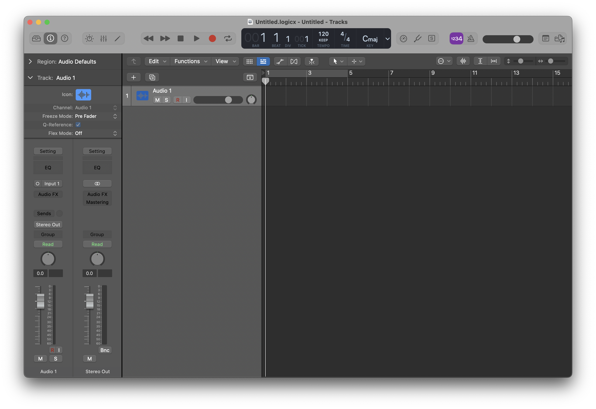

My first steps are to rename this track to _Left Guitar_ and then click the blue soundwave icon on the far left to pick a different icon, like a Les Paul. I then add tracks for a second guitar and bass, choosing good icons for them too.

Here is a screenshot after I've prepared Logic for a demo. There's no music here yet, but you can see each instrument represented with tracks for two guitars, bass, and drums. The guitars are labeled _left guitar_ and _right guitar_, but they are not actually panned left and right yet. We'll do that later, after we record some riffs.

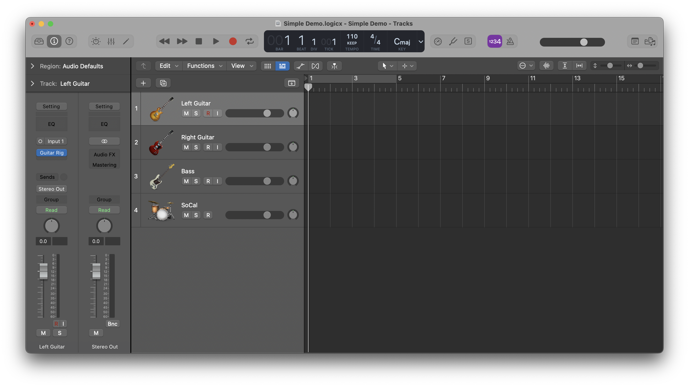

Notice that the drummer is a single track. That's because we're using the software drummer instead of recording actual drums. Most guitar players do not also play drums, so the software drummer is an incredible way to make demos that sound good anyway.

Using the software drummer is surprisingly easy. Most of the work is done moving a yellow dot around on a grid where one axis goes from simple to complex and the other goes from quiet to loud. If you want the drummer to do more fills, you literally turn up the fills dial. It's a lot of fun to play with and eventually you'll just have a sense of how to get what you want from it.

On the left, you'll see that channel EQ and compression are enabled. Logic does that by default, but we'll tweak all of that later too.

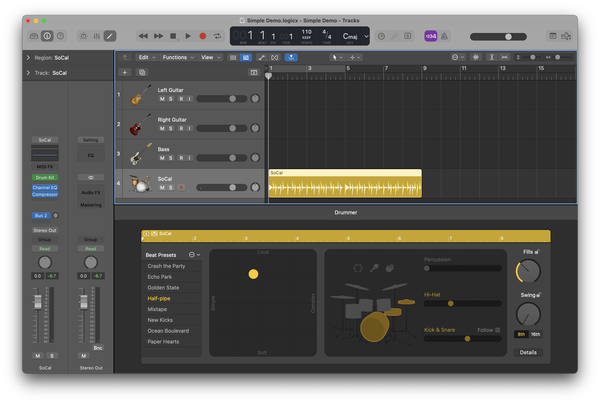

For funsies, I like to call the software drummer _Siri_ and pretend we play in a band together. _She's down to jam literally anytime and she never misses a beat._

Here are the tracks for the very first American Food song, called _False Starts_. It's an east coast style punk song that has a main singer and some backup vocals. Notice that the music is kind of like discrete chunks of music, like a riff played a few times. This lets me easily rearrange a song's structure, expanding or adding parts as I have ideas, eg. musical legos.

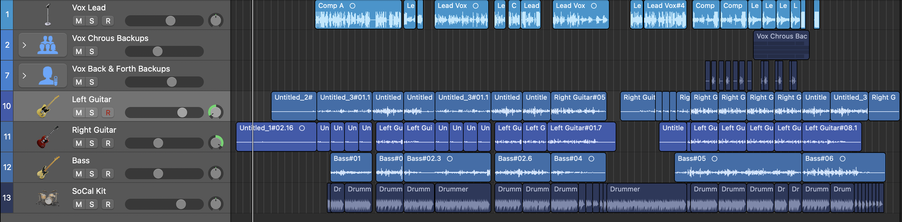

Singing is the top track, with backup vocals directly underneath. Then the instruments start, and they arranged using the demo pattern I described above.

This song was written during a time when I was trying to make as much material as I could, to create data that I would then use to learn Logic. The lyrics are silly, the guitars are _very_ 90's pop punk, and Siri totally rips on the drums.

We'll eventually get to something like this too.

# Start Without Software

There is always a phase before I hook up the computer where I'm wandering around my home, playing an unplugged guitar, trying to capture a feeling in the form of a few riffs. Sometimes two is enough, but more typically I aim for having three that feel like they flow together well.

Writing a song involves making a bunch of decisions about how things feel, and writing songs quickly benefits from having a framework for thinking about how to structure them. How to do this is always a matter of taste, but it can seem overwhelmingly random and hard to remember for anyone new at it.

So, start with 3 riffs. Think of them as playing the role of a verse, a chorus, and a brige. Trying playing the verse 4 times, then the chorus 4 times, and then the verse 4 times again. If that felt pretty good, then try the chrous 4 times, the bridge 4 times, and the verse 4 times. If it didn't, try writing other riffs until it feels right.

From here, the song _could_ be something simple like this:

1. **verse 2x**: without singing to open the song
2. **verse 4x**: where singing would go
3. **chorus 2x**: brief taste of the chorus
4. **verse 4x**: another verse with singing
5. **chorus 4x**: this chorus is twice as long as the other
6. **bridge 4x**: you can sing here, or make some part of the music come into focus more
7. **verse 2x**: quick verse, so singer can finish story told in verse
8. **chorus 4x**: visit the chorus one more time
9. **chorus 2x**: without singing, to close song

Or, in a line: **v2 v4 c2 v4 c4 b5 v2 c4 c2**

This kind of simple language is exactly how I talk in a room with musicians when we're writing a song. No one has to read sheet music or get into the weeds about some intellectual approach to music. We play riffs to each other and talk about repeating them some number of times in an arrangement.

# Track Errything

We'll first record guitars for what we have so far. Then we'll pan that track to the left and start playing out of the other guitar track to jam on the song and write the second guitar parts.

But first, amps.

## Simulated Amplification

There are many opinions about what amp sim is best. I use GuitarRig 6 because it does a fantastic job capturing the actual amps I like best, such as Orange AD30s, JCM 800s, or Vox AC30s. I play bass through its DI box setting and that sounds fantastic too. This is what you hear on the [American Food demos](https://soundcloud.com/americanf00d).

For punk rock demos, I like to use an Orange for the rhythm guitars and a JCM 800 for the leads. Orange amps focus on the mid range frequency and the 800 does a fantastic job of filling in everything else, so they sit nicely together in a recording.

In Logic, highlight the _Left Guitar_ track and find the _Audio FX_ button, shown below. Click that to open the plugins menu. At the bottom of that is _Audio Units_, where you'll find _Native Instruments_ and then _Guitar Rig 6_. Rockin, your left guitar is playing out of an Orange.

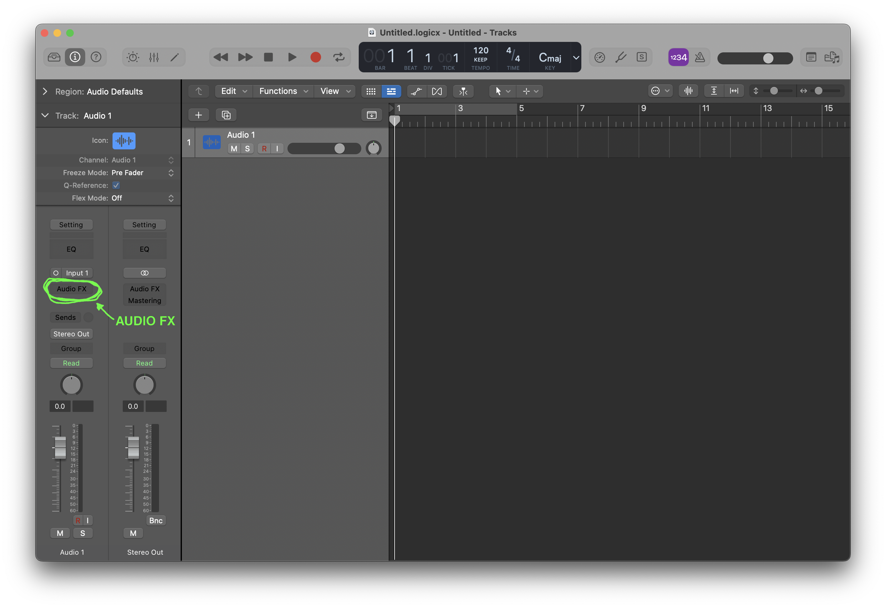

In Guitar Rig, look on the left for the amp navigation buttons and click _Amplifiers_ and then _Citrus_. A list of choices will now be focused on Orange Amp setups. Choose "Basic Citrus". This track now plays out of an Orange. In the section that looks like amplifiers, look for the words _INIT_. That's the menu for amp config presets. Click on that and choose _Fat Crunch_. We now have the same amp setup.

This is what an Orange amp, eg. Basic Citrus, looks like in Guitar Rig. The amp is dialed with the Fat Crunch preset. That's it, and it sounds huge.

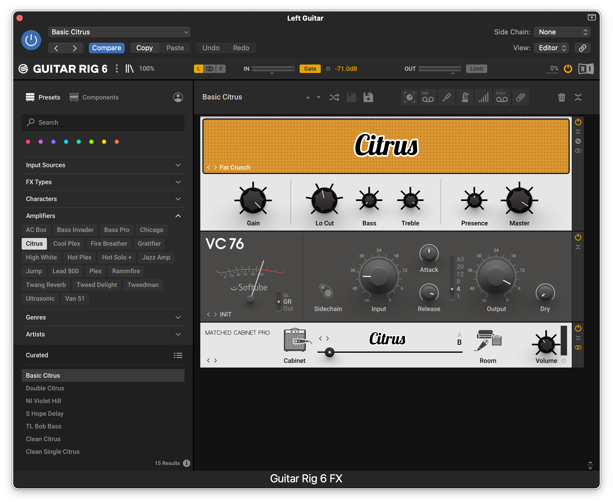

We'll do something similar for the right guitar track, so add the Guitar Rig plugin to the right guitar track. The JCM800 stacks are arranged under the _Lead 800_ amplifier in GuitarRig. We'll use the stack called "800 Rocks". It's a basic 800 with a tube screamer in front.

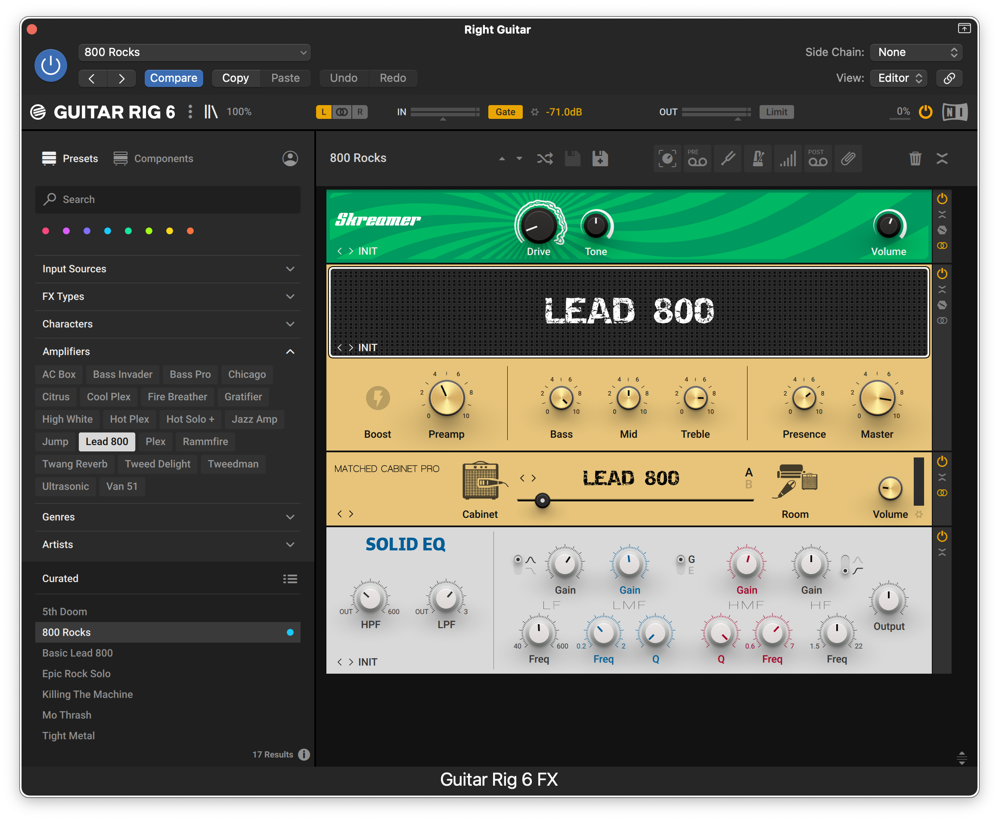

Add the GuitarRig plugin to the bass track too. Choose the _Bass Pro_ amp and the _DI-Bass_ stack preset.

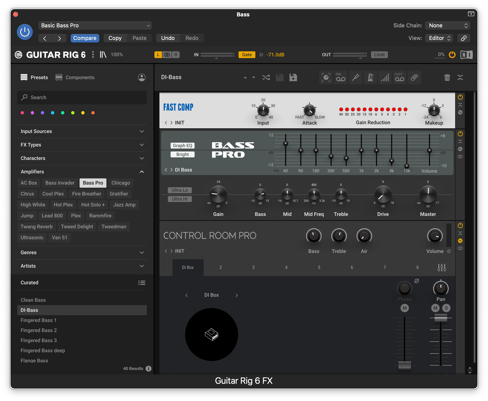

## Making Musical Legos

Before recording, we need to work out a suitable BPM. This process depends on everything being played along to a metronome. Siri also needs the metronome. For punk, 180 can be fun. The tempo is in the blue rectangle in the middle of the top of Logic.

Earlier, I mentioned that we can think of demos as musical legos. That starts here with the 3 riffs we have. We can track ourselves playing a single iteration of the verse, a single iteration of the chorus, and a single iteration of the bridge, and then copy / paste _that_ across the left guitar track until it matches our song structure.

The best part about this approach is that it can be done really quickly. I don't try to play the whole song, just each part enough times to copy / paste. Remember that the point of the demo is to capture an idea in a form where a whole band is represented, so dont lose trying to play everything perfectly. Playing it all _good enough_ is all you need right now.

Assuming that's done, pan the left guitar all the way to the left.

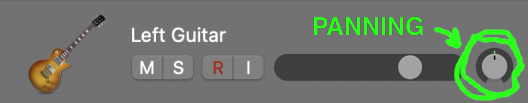

Now, highlight the right guitar track and you'll hear the JCM800 amp sound while you play along with the left guitars coming out of the Orange.

Jam along until you have written riffs for all 3 parts, the verse, chorus, and bridge. Then record the riffs and copy / paste like legos again, but this time dial the panning to the right.

You now have two guitars playing in stereo, so write and record bass parts using the same process. Bass stays panned to the middle though.

## Drum Parts

Logic's software drummer, Siri, can do a lot by herself, but we can also give her a lot of hints about the structure of the song, which she then translates into having several patterns that flow with nicely with what the guitars are doing.

The main way is to use blocks that are the same size as the guitar repititions. So, a single block that is the length of the entire verse, then another for the chorus, etc. Using this approach allows us to do things like use the high hats in the verse, but the ride in the chorus, and have drums in between parts to signal the transitions. Or another way, the kind of stuff actual drummers do in music.

In our song structure so far, there are 9 parts. Use the yellow "+" button no the drumming track to add 9 parts. Then shrink the length of each part down so that they length of each part when played on guitar. First drum part is the length of two verses, second is four verses, then 2 for the chorus, etc.

If you double click on any of the drumming blocks, you will open the controls for telling Siri what kind of beat you want. Below is a picture of what they look like.

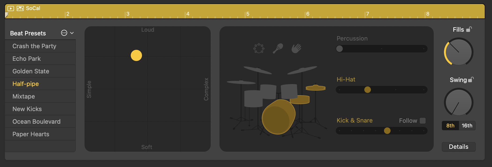

To keep things simple, switch the drums for every chorus to the ride cymbal. Then hit play and enjoy the first milestone!

# Sonic Landscaping

Now that we whipped up the gist of a song, we can start exploring how mixing and mastering works. The main ideas are based on making every instrument become clear and present alongside everything else.

EQ plays a vital role at the instrument layer. Compression is helpful there too, but not necessary for everything. There is also a concept of a _Master Track_, which we haven't discussed yet. Applying plugins to the master track means the plugins are applied to a single stereo track that represents the entire song. Compression & EQ are also vital at the song layer.

## Instrument EQ

Similar to how we added the GuitarRig plugin to our tracks, we're going to add a _Channel EQ_. Click the space below the GuitarRig plugin and follow the menus from EQ to Channel EQ to Mono. It should look like this when you're done.

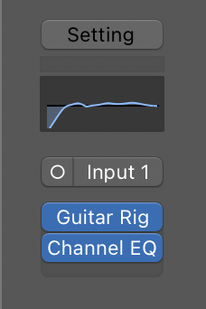

And here is what the EQ plugin UI looks like. It's flat when you first open it, but we'll give it some personality in a moment.

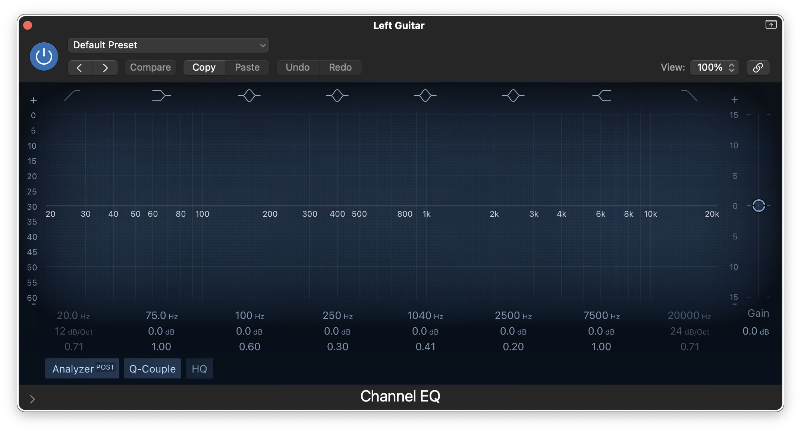

For the left guitar, we'll use a basic preset called _Guitar Sweetener_. This preset is subtle, mostly tweaking a few places that improve the clarity of a mid-range focused amp, like the Orange we are using for this track. It also cuts all the frequencies below 70hz, removing any data from the signal that might emphasize the bassier frequencies in a way that muddies up the signal.

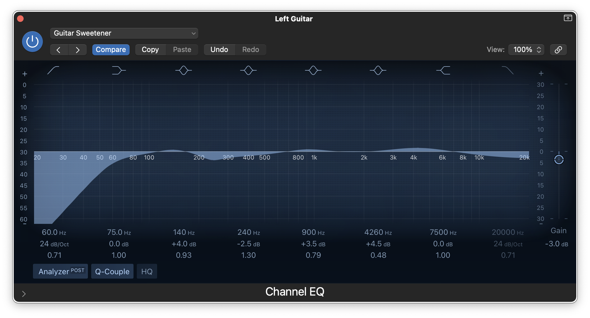

On the right guitar, we'll use a preset called _Picked Electric Guitar_. This preset minimizes the bassier frequencies and emphasizes the higher frequencies. This has the effect of ensuring the rhythm guitars and the leads occupy a different frequency space, giving them significant clarity relative to each other.

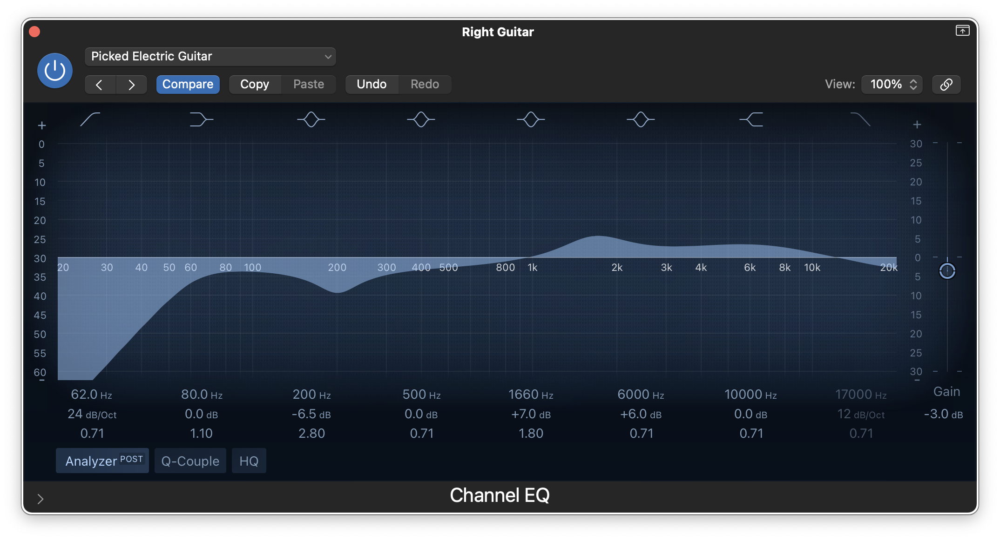

And finally, for bass we'll use a preset called _Jazz Bass_. This preset emphasizes a range between 50hz and 175hz, which neither of the guitar EQs emphasize, to give us the low punch of a bass. It also emphasizes 1320hz, with a hill from 300hz to 4k hz, giving the bass some clarity. With both, we feel the low end and can easily understand which notes the bass is actually playing.

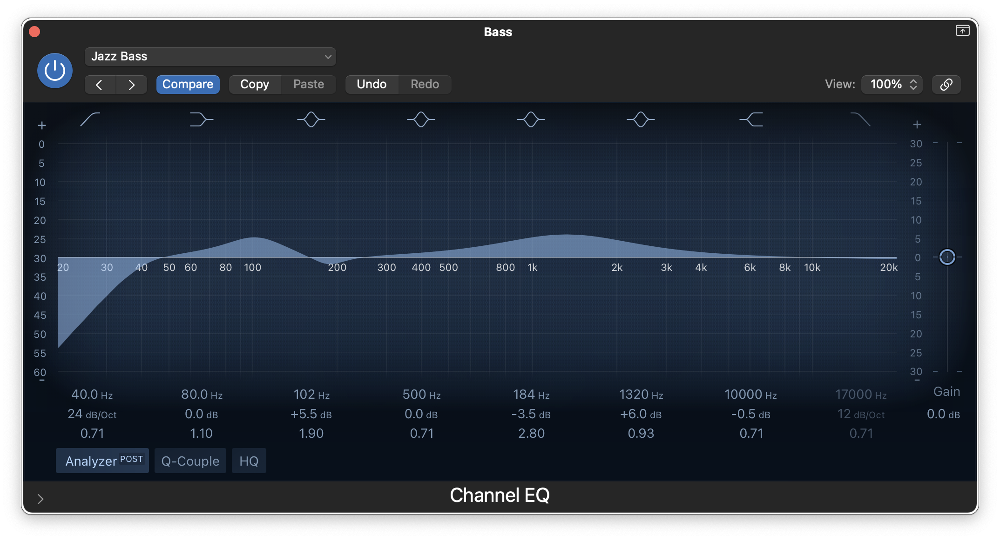

With all three EQs configured, you should be able to hear a significant different in the quality of your demo. We're not finished, but my hope is that you now have a meaningful impression of how important EQ is.

## Compression

Most people have a sense of what EQ does, either from turning knobs on their guitars and amps or from using EQ with their music players. Compression, however, is something quite different and there is little reason to think anyone would know how it works without having tried music production before.

I have drawn an uncompressed soundwave, with a green border to capture how loud the loud parts get relative to the how quiet the quiet parts are.

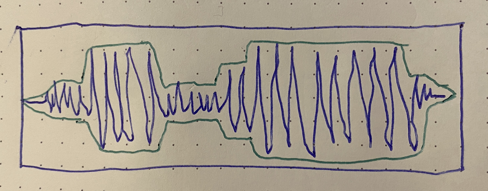

Below is what happens when you _compress_ a sound wave. The loud parts get quieter and the quiet parts get louder. This has the effect of ensuring quiet parts are always present and loud parts don't shock the listener with a drastic increase in volume.

I have drawn a compressed soundwave, and another green border, to show how much more chill a compressed wave is.

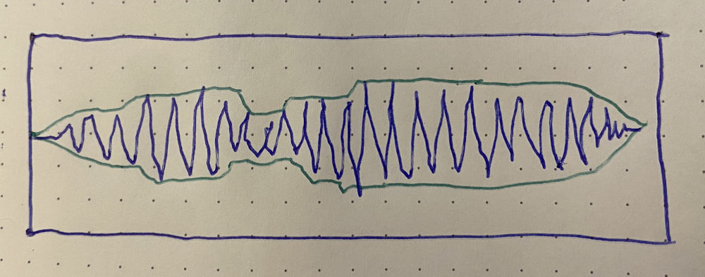

Add the compressor plugin to the Left Guitar track and arrange the plugins such that the compressor happens before the EQ, like you see below. Choose the _Guitar Heavy_ preset. Do the same with the Right Guitar track too.

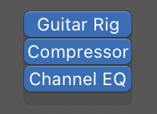

The personalities of the guitars come from the guitar and amp setup and they still have those personalities after compression is applied. So, we can use the same preset for both guitars. Don't worry too much yet about what all the knobs do, but you will also notice the guitars got significantly louder too. Turn the volume for both tracks down until you can easily hear both guitars next to the bass and Siri's drums.

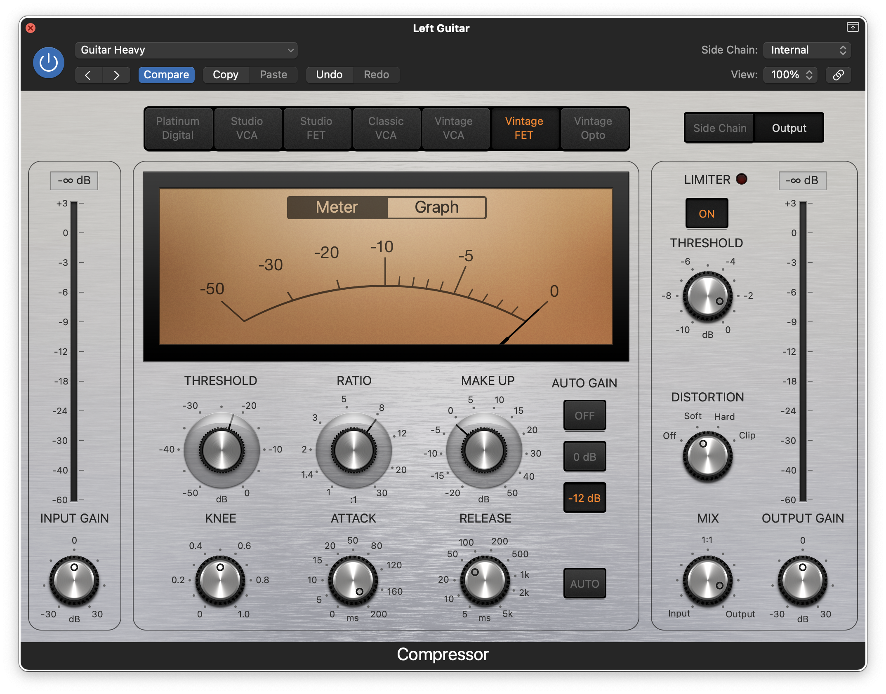

Bass uses a similar preset, called _Bass Heavy_. The bass will also get a lot louder after compression is turned on, so turn the bass track volume down until you can hear the bass, both guitars, and drums clearly.

## Drum Sounds

Time to tweak the drums. We'll first set some volumes for the different parts of the drum set, then we'll add EQ and compression. If we were recording an actual drummer, we would need several tracks and many microphones. Working with Siri is significantly easier exactly because we don't do any of that complicated work.

### Volumes

Highlight the drum track and press "B" to bring up the _Smart Controls_. On the left there is a section labeled _Mix_ with knobs for the kick, snare, etc. If you are using the SoCal drummer, which is my favorite, the following volumes will sound like punk drummers do on records:

* Kick at 2dB
* Snare at 3.5dB
* Toms at 0dB
* Hi-Hat at -2dB
* Cymbals at -2dB
* Percussion at 0dB

This puts the kick and snare out in front, for the driving feel of punk drumming, and puts the swishy stuff, the hi hats and cymbals, more in the background. By moving the swishy stuff to the background, we create space that the guitars fill, giving the record a feeling that it is huge.

### Compression & EQ

The software drummer track already has Channel EQ and Compression on by default, so we just need to choose presets. For Channel EQ use _HiFi Drums_ and for compression use _Drum Room_, and these drums should sound crisp and punchy.

# The Master Track

We've now reached the part where we move above the individual tracks and work on the complete song. We'll use compression & EQ again, but we'll also introduce a thing called _Linear EQ_.

Up to now, we have been adding plugins to individual tracks, which are in the left most of the two columns on the left. This time, we'll be adding plugins to the other column.

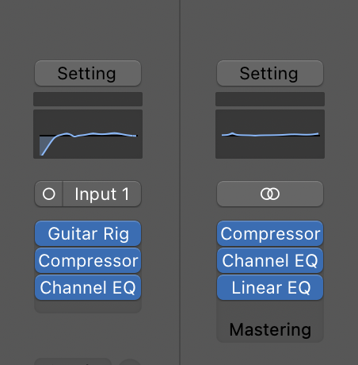

The compressor's preset _Platinum Analog Tape_.

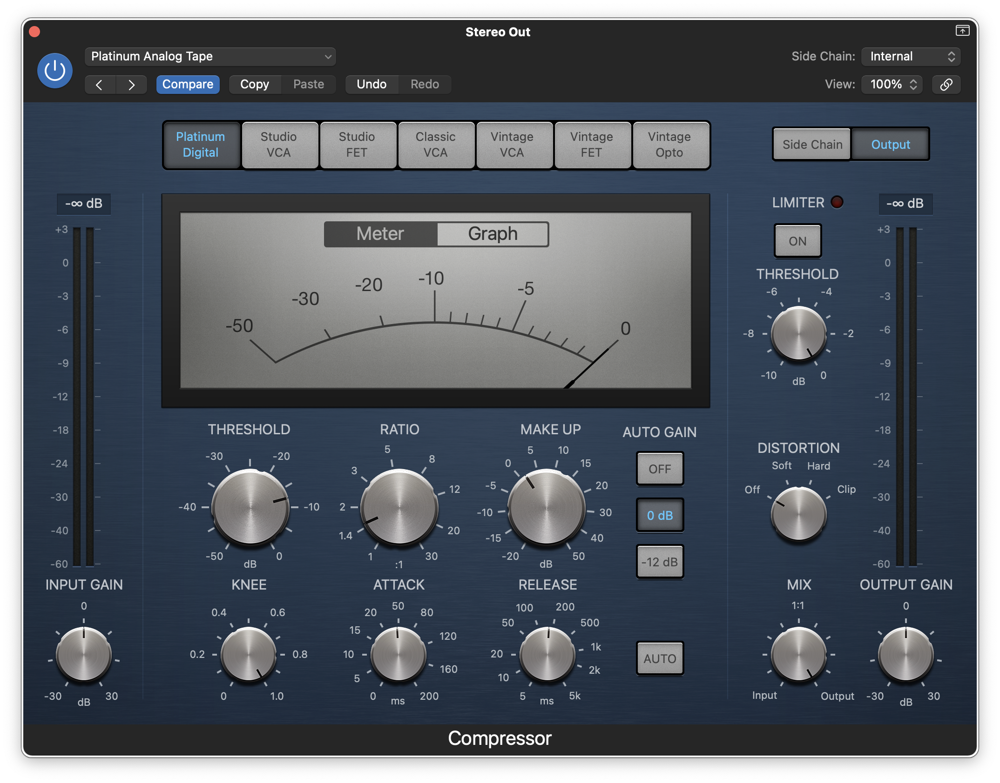

The Channel EQ uses the _Final Mix - Rock_ preset, under the mastering menu. 

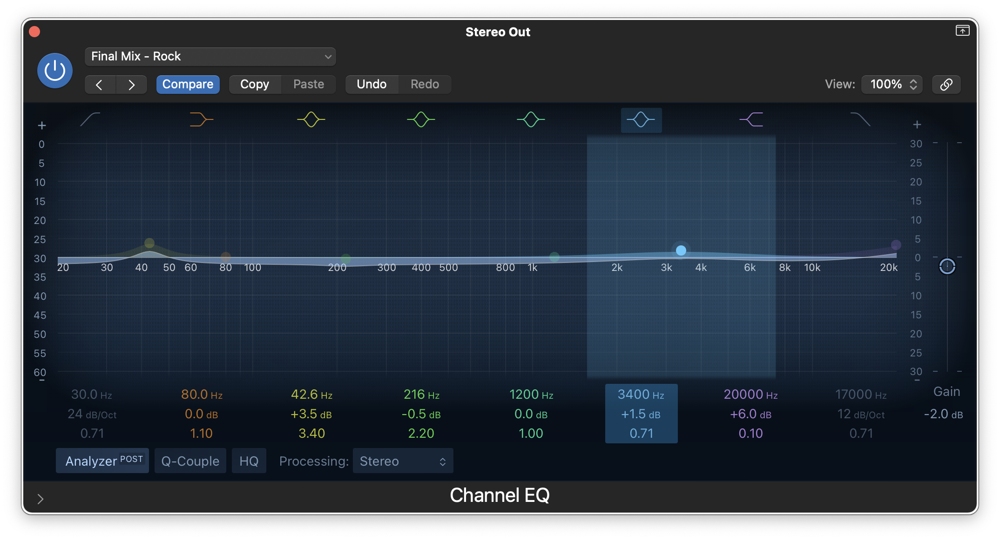

The Linear EQ also uses a preset called _Final Mix_ under the mastering menu.

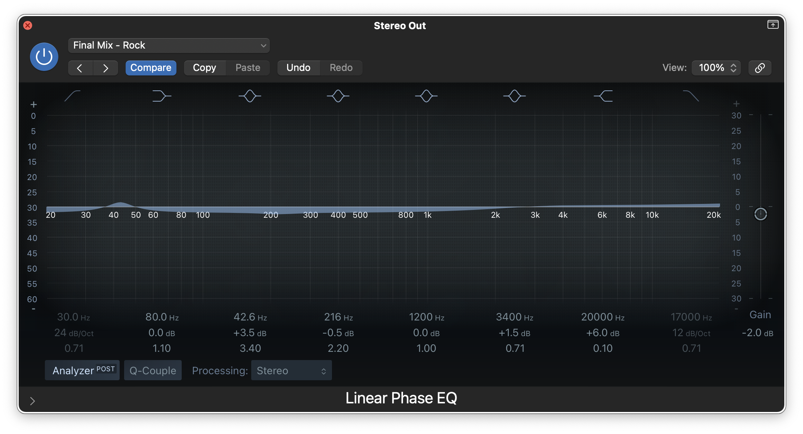

From here, just tweak the volumes of the guitars and bass until everything sounds pretty good, and you're done!
