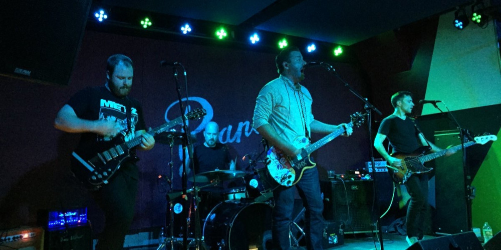
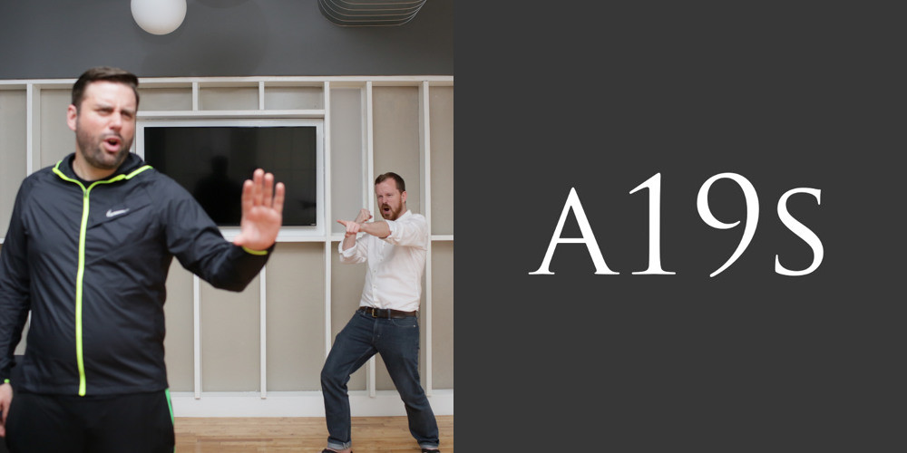
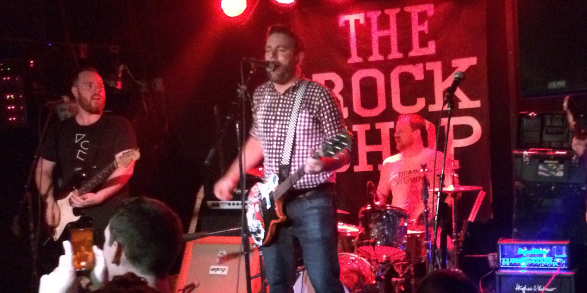
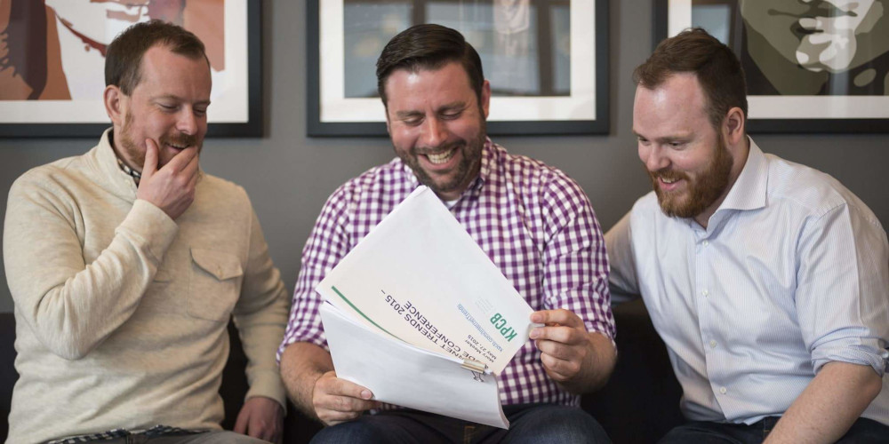
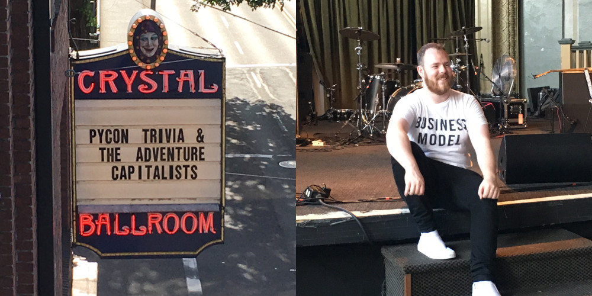

Adventure Capitalists were a startup themed punk band from Brooklyn, NY.

I met Rob Spectre through the NYC tech community. He presented at a meetup I organized, hack&&tell, and his laptop was covered in stickers for punk rock bands and I thought, "well... I need to be friends with that guy."

We didn't expect to start a band. We were both busy working with startups, but we figured out we both play music and we started jamming. We played covers of 90's punk bands for a while, and then the Snowden disclosures happened... While discussing it, we started having ideas for funny songs we could write about it and ways to use startup tech as part of the gag.

We had an idea for a song that would annoy NSA by nature of being forced to listen to it. To be annoying, the song's lyrics would be a series of spoilers for pop culture. Anyone who listened would hear the ending of every popular some show or movie. To force NSA to listen to this song, we used the Twilio API to put it behind a phone number. If you called the number, the song would play over a phone call, which would force NSA to listen as we gave away the ending of so many popular books, shows, and movies.

We had so much fun with the NSA song that we wanted to keep going. We imagined doing something like a cross between the Silicon Valley, the TV show, and Blink 182. The band's name, _Adventure Capitalists_, was inevitable after that. Rob and I wrote 5 more songs and tracked our first EP, **MVP**, as we could find time over the next couple years.

We wanted to turn this into a real band and agreed to recruit a bassist and a guitarist after we released the EP. I played bass and guitars on the EP too so we could pretend we were a full band with this next release. Fake it til you make it, or something. We recruited Kilian McMahon on guitar and Jameson Dempsey on bass.

We wrote our final EP, **Unicore** together as a band and went into the studio in 2017 and released the EP in 2018.

# Recordings

## Unicore

Our last release. 6 songs, released in 2018. Recorded with Greg Giorgio.



## MVP

Our first EP. 6 songs, released in 2015. Recorded with John Miller.



## No Spoilers Allowed

Our first single. Released in 2013. Recorded by me and Rob.



# Videos



# Photos

