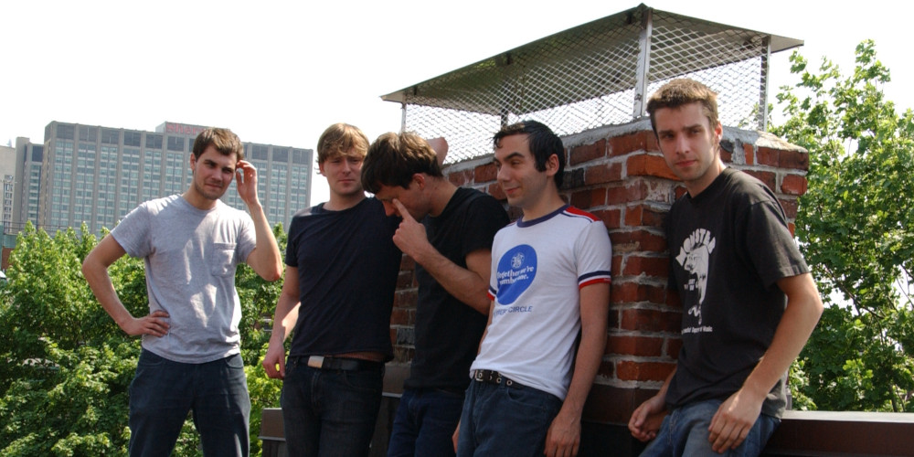
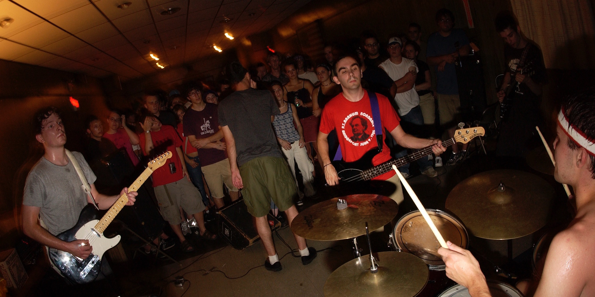
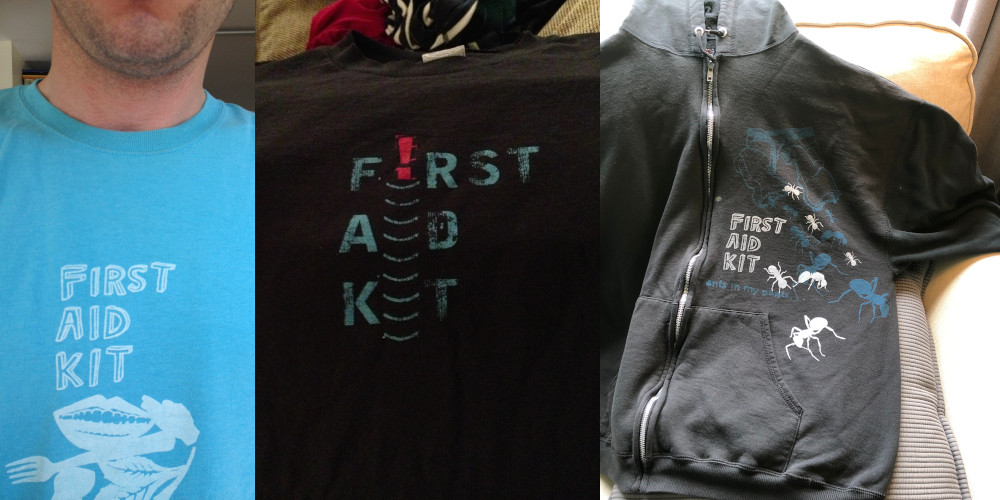
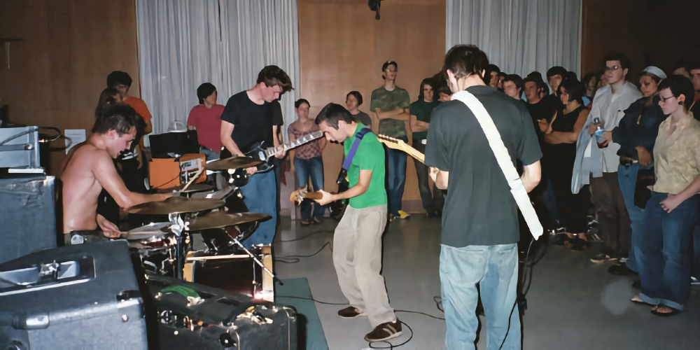
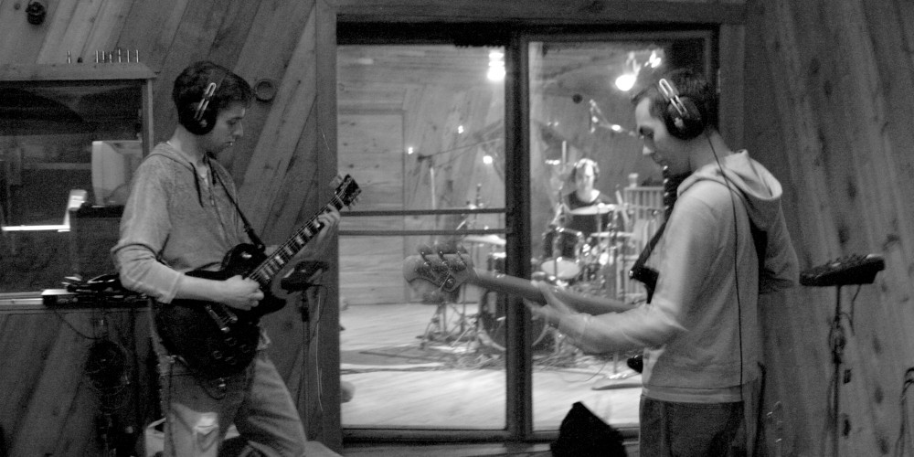
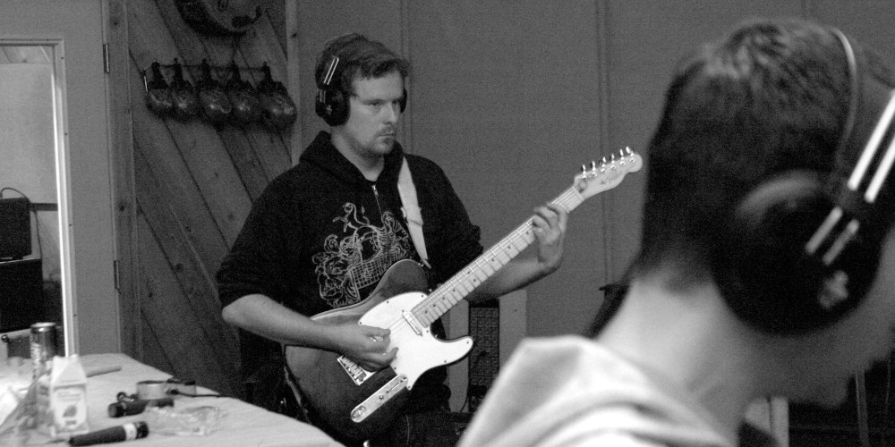

First Aid Kit was an post-rock band from Rockville, Connecticut, formed in 2001 and disbanded in 2004.

We released a full length, *Frights And Shivers*, an EP, *Forgot ID*, and two more songs after we broke up. Over the band's lifespan we toured the east of the US extensively and Canada.

This band had strong opinions and it was in your face about them. We didn't set out to write music that was easy to listen to. We wanted to write music that challenged the listener's sense of melody and time, and we wanted to deliver that with lyrics urging us to think harder about the decisions we make in life.

We were a live band. We thought of everything we did as a series of moments. We played as many shows as we could. All of our recordings were tracked live. And JP, our singer, closed every show thanking the audience for their ears and their time. We typically wrote music by jamming in a room together too. 

In retrospect, we were a wildly productive band. We were too busy trying to get everything done to ever take a moment to appreciate that. Brad (guitar) and JP (vox) designed all our merch. JP started a record label, called Said Sew Recordings, and released all of First Aid Kit's music via that label. I handled putting most of that on the Internet. DIY through and through.

# Recordings

## One Offs

Our third recording. 2 songs, recorded in 2005, but never actually released. Recorded with Greg Giorgio.



## Forgot ID

Our second recording. 3 songs released in 2003. Recorded with Greg Giorgio.



## Frights And Shivers

Our first recording. 11 songs released in 2002. This is the first record I did with Greg Giorgio.



# Videos

A music video for Living or Lively made with footage from a tour First Aid Kit did with Finch, Recover, and Counterfit in 2004.

 

A performance from 2003 at the El N Gee in New London, CT.



# Photos

