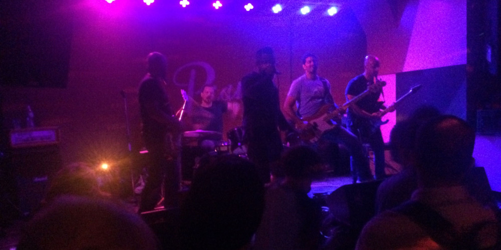
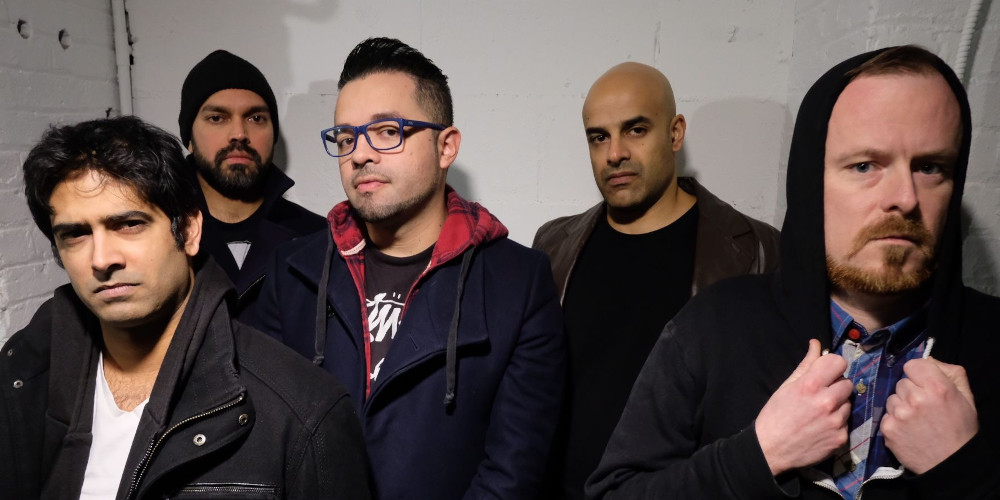
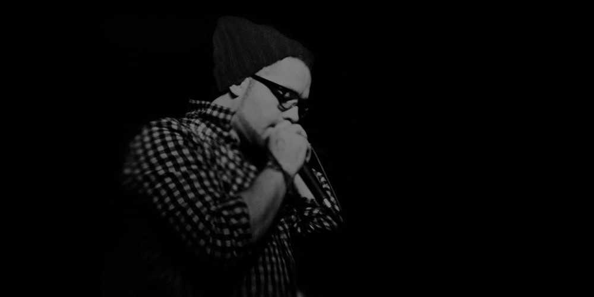
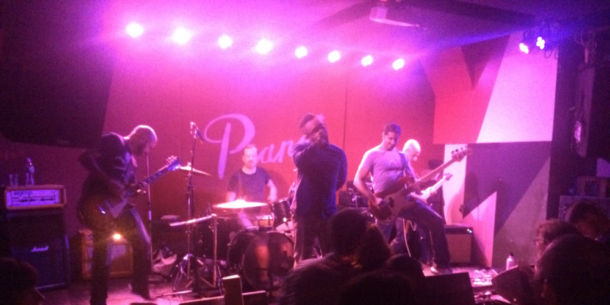

Medio was a rock band from New York City.

It was 2007 and I was working at Bear Stearns (RIP) and learned there was a Wall St Battle of the Bands. I went and found the bands were terrible, and I wanted to make a band and play the next year. I found someone with a Sepultura tattoo, convinced him to jam, and off we went.

The members of this band were always career driven. We'd play whenever our busy schedules allowed, which was never often enough, and we wrote heavy, dirty songs about life. This band loved to shred and our singer loved to flow, so the music we wrote was was somewhere between Mars Volta, Deftones, and Tool.

After a few years, our drummer wanted to leave the band to study for the CFA, a grueling test that financial analysts spend 3 years preparing for. I was already starting to dabble with playing drums at the time, but his departure gave me a way to become an actual drummer, so I bought his old kit and switched to drums.

# Recordings

## Live @ Pianos 07.11.15

This is the complete set, except for the first song, from my first show playing drums with Medio.



# Videos

## Roku (Drums)

This video is from my first show playing drums with Medio. This is also the first song this band wrote after I became the drummer. All these years later, playing these drums is still some of the most fun I have as a drummer.

 

## SCLD (Drums)

This song is a wildly complicated one. We wrote this song back when I played guitar in the band, with my contributions intentionally trying to give our drummer a gnarly challenge. The irony was very funny for me, years later, as I tried to take on this beast of a song.

 

## Just Watch Me (Guitar)

Arlene's Grocery 11.04.11

Here is a video from our show at Arlene's Grocery on Nov 4th, 2011. I'm playing the black Tele on the left of the stage.

 

# Photos

