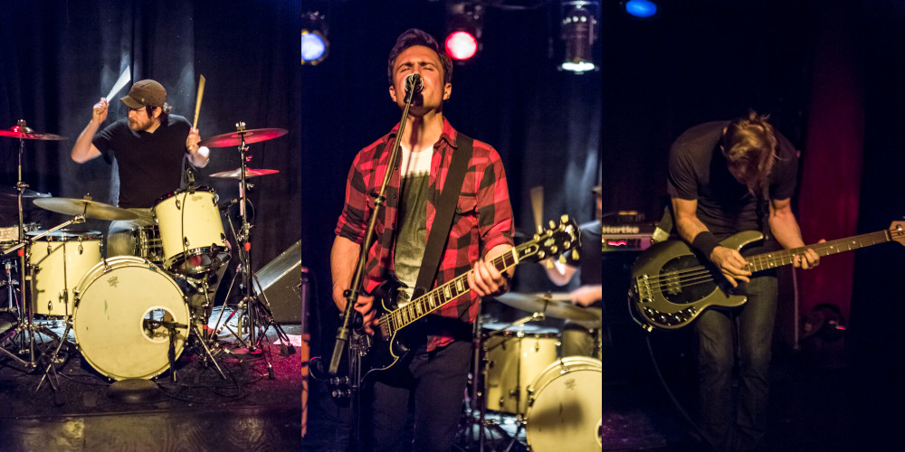
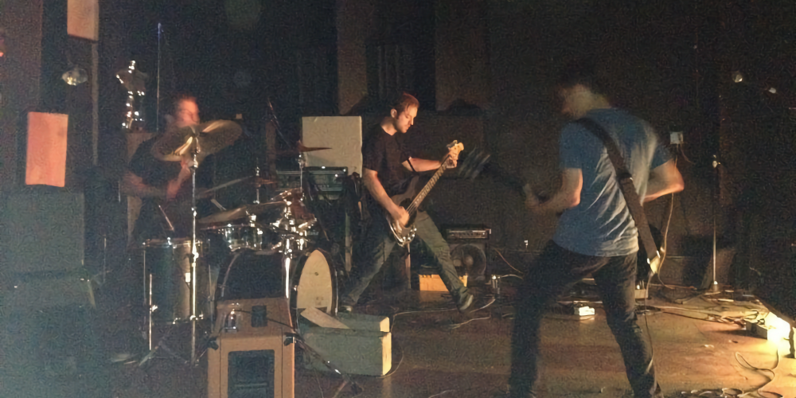
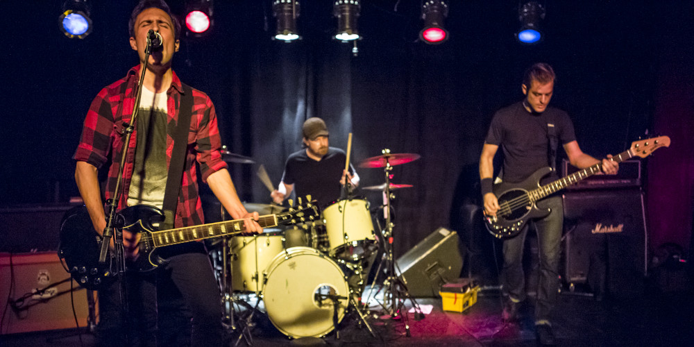

Sea Graves was a post-hardcore band from Brooklyn, NY.

Jameson and I had been friends for a long time. He'd play in First Aid Kit on tours when members couldn't go. We also played in Shipyards together. While playing in Shipyards, we started to feel like we had turned the amps down too much and our songs had become too slow. We wanted to do something loud and fast again, but we also wanted to reinvent ourselves.

I started playing drums, because of things happening in Medio, so I would play drums jamming with Jameson too. We wrote a few songs and loved how it felt to play loud music again, so we reached out to a friend from the CT hardcore scene, Jack, and got started.

This band moved very quickly. Jameson was planning to move to DC after finishing law school, so we knew the band wouldn't have much time to live, but we wanted to play music together as much as possible anyway. We had enough songs to go into the studio shortly after Jack joined the band. Jameson then moves to DC to start his career in law and the band became inactive.

# Recordings

## Congratulations

Our first recording. 3 songs released in 2013. Recorded with Greg Giorgio.



# Video

This video is from the first Sea Graves show, which was also the first time I performed drums live.

 

# Photos

