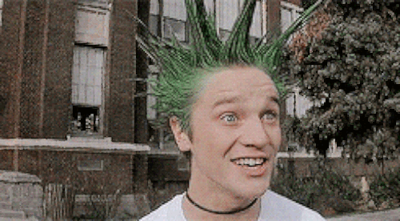
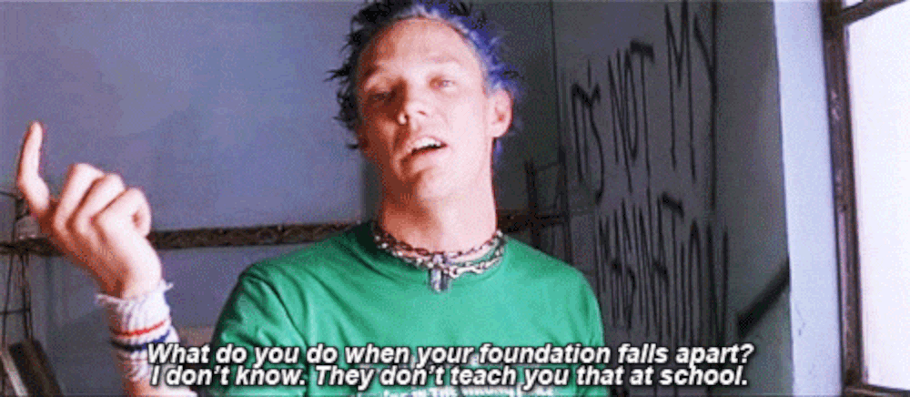
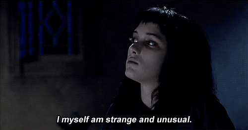

I have been thinking about something Jean Baudrillard said a lot recently. It comes to mind because of the current moment and what is happening around generative AI.

Prior to the current moment, I believed he was more cynical than necessary. The current moment changed that for me because it I now wonder if we might actually bring about some of the futures Baudrillard talked about. In particular, a future where art dies.

> Art does not die because there is no more art. It dies because there is too much.
>
> — Jean Baudrillard

That quote has been in my mind because it causes me to consider difficult questions that don't have clear answers. What happens to art in a world where AI can generate more art at overwhelming speed? Could he have been right after all, and art dies because new tools let us make too much of it? What does mean for artists too?

## Artists Gonna Art

Baudrillard was a philosopher, so it makes sense he would expand questions about the meaning of art until he reached the existential questions about how _art_ dies. He worries that great art will get lost in the sea of noise created by a flood of ordinary art. Art's power to describe, compel, and renew would fade into obscurity and get replaced with art that is little more than, in his words, "a meta-language for banality".

_Wait a sec... did he just say we're losers with nothing interesting to say?! Screw that guy! Why should **we** care what **he** thinks?! Maybe we want to hide in the sea of noise? Maybe we don't care about the mainstream?! Maybe that isn't where we want to be at all! Maybe we are different because our ideas are better?!_

For creative folks, the rebellion is automatic. It is a side effect of being different enough to have experiences that require defending a nonconsensus view. Consider someone you know with strong opinions outside the norm, wouldn't they laugh if we said the people they disagree with are _a sea of noise_? Imagine the punk below sarcastically saying they're scared of not fitting in.

Creativty starts with seeing the world as a thing that can be modified or improved upon. Every experience is an opportunity to have ideas about some new context. Over time, they become good at generating streams of ideas, each of which is a potential divergence from the status quo. Simply imagine _something different_ from _what is_ enough times to have lots of ideas for improving _what is_ and the status quo inevitably becomes a dumpster fire to be avoided.

Being creative alone can be satisfying, but being creative with others is extraordinary. The things we create can become something bigger than any individual when several perspectives work together.

Finding other people comfortable with a constant flow of ideas is frustrating. All creative thinkers eventually find out the hard way that most people are not creative thinkers. The creative process itself doesn't really make sense to most people. Worse, a typical person experiences a creative person thinking out loud as though the creative has no clue what they are talking about. Typical people don't catch the subtle cues that discard bad ideas while collecting the good ones, so it reaches them as a jumbled mess that is easy to criticize. That interpretation isn't totally wrong, because the creative person was sharing both the good and bad ideas as they came to mind.

Artistic communities can be built around groups of creative folks that are sick of that experience. They want to spend time with folks who are also sick of that experience. They pride themselves on the way they diverge from the norm. It expresses who they are, relative to the norm. The differences are part of their identity. After all, what even is an artist if not someone who wants to convey a unique perspective?

These communities go by different names. Sometimes they're called _scenes_, like _the NYC art scene during the 70's_ or _Connecticut hardcore_. Sometimes they're called collectives and they consist of a small group of people who all know each other. Similar to art, the way creative people organize comes in many forms and their creative output flows in similar directions.

## Art and Art Forms

Art, as a concept, can be hard to define. It comes in many forms. Some folks claim that everything is art. Leonardo da Vinci saw things that way. Abstractly, art is some expression of feelings, thoughts, and perspectives. More tangibly, art is usually the result of some effort applied towards creating something, like a painting, a poem, a building, clothing, a video game, etc. 

Humans have been making art for a long time. There are [neanderthal cave drawings](https://www.smithsonianmag.com/science-nature/oldest-known-neanderthal-engravings-discovered-in-french-cave-180982408/) in France that go back 57,000 years. The oldest known "representational" art is an Indonesian [cave painting of a pig](https://www.smithsonianmag.com/science-nature/45000-year-old-pig-painting-indonesia-may-be-oldest-known-animal-art-180976748/) that goes back 45,500 years. The oldest known depiction of a human, the [Venus of Hohle Fels](https://en.wikipedia.org/wiki/Venus_of_Hohle_Fels), is from 40,000 years ago. 

I struggle to believe that humans will stop expressing themselves anytime soon, let alone while I'm here to see it, so I don't believe art will stop being made. The mediums we use to create art, or _art forms_, are different. They are more transient. They exist as one of the possible ways humans can express themselves. Art forms _can_ die. They die when humans don't care enough to use them anymore.

It is more interesting for me to consider when they become part of some larger art form instead. It stops being _the_ consideration and joins other art forms as _one of many_ considerations working together. For example, we usually experience poetry as lyrics in a song. We experience more photography as frames in some video than as individual photographs. Both music and video have rich histories with extraordinary ingenuity behind them, but they're just one of the many things a computer might do when we play video games.

## E Pluribus Unum Systema

As of recently, we live in a world where computers can generate art that is so good we now struggle with distinguishing between art made by humans and art made by algorithms. And more, the new systems can generate the works almost instantly. Consider waiting a few minutes next to the time required for humans to gain an artistic skill and then use it to produce works. 

From a purely practical perspective, skilled humans may not be necessary the same way they have been up to now. In theory, a lot of the former constraints in making art have been removed, which could mean we will see an enormous increase in how much art gets made. This becomes existential if we consider what Baudrillard said again. I'll frame it as a question. _Could genAI cause us to make so much art that art dies?_

I don't worry about art dying, as I said earlier, but I do worry about all the people who have spent years honing their skills and creating amazing things. If their work can be digitized, it can also be used as training data for AIs. The Internet has driven us through doing a lot of that digitization work already, too.

It is legally ambiguous, as of now, whether or not AI companies have to pay for the right to use all that work as training data. We can probably assume companies will be companies, though. They will probably attempt whichever path gives them the most advantages. They will probably also behave as though it's all legal.

Also recently, we live in a world where our artistic identities are being expressed in one form or another inside generative AI models whether we like it or not.

_I do not believe it is legal, fwiw. I expect the courts to get very active soon in resolving the rights issues for AI. Alas, that hasn't happened yet._

## Hiding In The Data

LLMs seem to have a bias around the patterns most present in their training data. Intuitively, models _should_ focus on the patterns most present in the data. They are the clearest signal in the data and that translates into excellent performance from the models when doing things with those patterns. Or another way, models find the clearest signals in data around the patterns that represent a kind of _mainstream_. If we built a model around all the music in Spotify, it's very likely Taylor Swift would provide clear signal.

As any creative knows, the popularity of some idea is quite different from how important it is. Copernicus knew this, Rosa Parks knew this, Ben Franklin knew this. It isn't just people who changed history either. I'd like to also claim that most of the bands I listen to also know this, but it becomes trickier to claim because it forces us to consider how subjective claims of importance truly are.

The algorithmic bias towards mainstream emerges in interesting ways. Summarization is commonly considered an example of a task LLMs are very good at. This matches the gist of my experience too. When I would query them for summaries of historical figures, it usually got the most important things. Something different happened when I generated summaries for more obscure figures. It became apparent the summaries were skipping over the things I liked best about them. Popular figures benefit from a steady flow of subjective analyses made by individuals over time. For less popular figures, somewhere between obscure and somewhat popular, the most interesting things about them fades into the background and isn't emerged in the summaries.

The same bias emerges differently when research papers are summarized. The findings of the paper that are already well known get a lot of presence in the summary. The novel findings, eg. the most important ideas, are skipped over precisely because they are less well known. What's happening here seems like the right behavior for contexts that are improved by optimizing for _consensus_.

Whenever it's true that important ideas that are not well known can live alongside important ideas that are consensus, it is also true that unique communities can exist alongside much bigger mainstream communities without drawing much attention to themselves.

I feel some relief when I think about it like this. It makes me wonder if there is a way for creatives outside the mainstream to leverage obscurity in ways I haven't thought about yet. Perhaps by hiding in the data's periphery more intentionally. I find that exciting because if it were true it would mean there are ways we can push back against the total disregard for our rights as creators that many leaders in tech have advocated for.

What I'm most interested in are approaches for creating art that becomes increasingly obscure as more is made. I want to understand how art can survive in a world where all of our work might be downloaded for use as training data, yet the AIs created cannot produce new work based on ours. I feel as though what I want is to build underground art scenes where the definition of _underground_ is based on whether or not an AI can reliably copy it. If it can, maybe the art isn't original _enough_, or something like that.

_Maybe we want to hide in the sea of noise? Maybe we don’t care about the mainstream?! Maybe that isn’t where we want to be at all! Maybe we are different because our ideas are better?!_

I keep thinking about this. About what it means to be build underground scenes inside oceans of data. I want to understand what it means to not fit in, whether intentionally or not, as society goes wild attempting to put AI in literally everything going forward.

