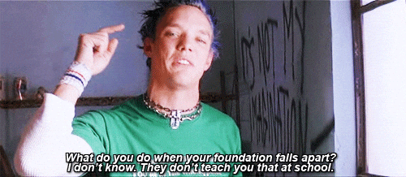

As I think about generative AI, especially with respect to art, I keep coming back to these words from Jean Baudrillard.

> Art does not die because there is no more art. It dies because there is too much.

I enjoy statements that boldly invert one truth to reveal another. The initial truth, art could die if no one made it anymore. That one is obvious. The second truth, art could die if it became so ordinary that people lost interest in it.

Alas, there is an issue with his framing. It seems unrealistic that the abstract concept of _art_ would die, as it has existed alongside humans for so long that I just don't see that changing. Art is a type of personal expression and expressing ourselves is just a core part of being human.

Check out what happens if we say artform instead of art.

> Artforms do not die because there is no more art. An artform dies because there is too much of it.

Artforms actually do die when people lose interest in them. Some might say something important is lost when the artform dies. If I loved the artform, I would probably say that too. Outside of contexts that I have a personal connection to, I see things differently.

The quote has a fatal, existentional tone to it by talking about death. It doesn't leave much room for evolution. Is it bad if the old artform evolves in some way that makes it easier to express ourselves? Expressing ourselves is The Thing in art, after all.

My favorite evolutionary path for modes of expression is when an artform become a feature of some larger artform. Instead of being _the_ consideration, it becomes _one of many_ considerations. We usually experience poetry as lyrics in a song. We experience lot more photography then we realize because of the way it functions as frames in some video. Both music and video have rich histories with extraordinary ingenuity behind them, and they can function as just one of the many things a computer does when we play video games.

## Out Of Many, One Model

As of recently, we live in a world where computers can generate art that is so good we now struggle with distinguishing between art made by humans and art made by algorithms. And more, the new systems can generate the works almost instantly. Consider waiting a few minutes next to the time required for humans to gain an artistic skill and then use it to produce works. 

_There are obviously important ethical considerations around how these models are created, but I am approaching it as though the big AI companies are essentially unrestrained in what data they use as sources, as that seems to be the case until it the legal system catches up with it._

From a purely practical perspective, skilled humans may not be necessary the same way they have been up to now. In theory, a lot of the former constraints on how often art is created have been removed, which could mean we will see an enormous increase in how much gets made. It becomes existential if we consider what Baudrillard said again. What if genAI actually _does_ allow us to make so much art that art dies?

## Artists Gonna Art

Baudrillard was a philosopher, so it makes sense he would expand questions about the meaning of art until he reached the existential questions about how _art_ dies. He worries that great art will get lost in the sea of noise created by a flood of ordinary art. Art's power to describe, compel, and renew would fade into obscurity and get replaced with art that is little more than, in his words, "a meta-language for banality".

_Wait a sec... did he just say we're losers? With nothing interesting to say?! Screw that guy! Why should **we** care what **he** thinks?! Maybe we want to hide in the sea of noise? Maybe we don't care about the mainstream?! Maybe that isn't where we want to be at all! Maybe we are different because our ideas are better?!_

For creative folks, the rebellion is automatic. It is a side effect of being different enough to have experiences that require defending a nonconsensus view. Consider someone you know with strong opinions outside the norm. Wouldn't they laugh if we said the people they disagree are just _a sea of noise_?

It starts with a creative mind that sees the world as a thing that can always be modified or improved upon. Every experience is an opportunity to think about some new context. Over time, they produce streams of ideas and each one is a potential point of divergence from the status quo. Simply imagine _something different_ from _what is_ and create a potential point of divergence, eg. an idea.

Generating ideas is fun. It's also error prone. To find the great ideas we usually have a bunch of bad and ok ones in rapid succession, and our memories can't quite keep up either. We try to throw the bad ideas away and keep the good ones, but it all happens so fast and we're doing it with almost no certainty.

We soon try to generate ideas with others and say outloud what's going on in our heads. Not long after that, we find out some people just aren't creative the same way. They experience us thinking out loud as though we have no clue what we were talking about. That isn't totally wrong, because we were _thinking out loud_. Having both good and bad ideas out loud is part of how that works. Less creative folks won't understand the back and forth groups have when they're being creative together. Group creative processes instead reach them as though the people involved have no idea what they're talking about and wasted the time.

Artistic communities can be built around groups of creative folks that are sick of that experience. They want to spend time with folks who are also sick of that experience. They pride themselves on the way they diverge from the norm. It expresses who they are, relative to the norm. The differences are part of their identity.

What is an artist if not someone who wants to convey a _unique_ perspective in an **amazing** way?

## AI as The Masses

We can, however, take an approach centered around falsifiability and speculate about why some ideas won't really change anyone's behavior, even if they're technically quite interesting. Changing behavior is always the thing that matters.

One thing is for sure, AI companies have already created models that are trained on all kinds of artforms and artistic styles. Song generation models can create music that sounds like my favorite bands. Image generation models can produce images that appear as though they were captured with a specific type of photographic lens. So many modes of artistic expression, each with so understanding of style, are represented inside modern AI.

A common way for AIs to make mistakes is that they will focus on things better represented in their training data, when it would be preferred for the model to do a better job noticing the value of obscure ideas. In a way, AI models are something of a blob that focuses on mainstream thinking. For ideas to be mainstream, they have to show up as consensus, which means they're well represented in the models. In a way, modern AIs models, like LLMs and Diffusion models, are essentially a representation of The Masses!

We can build on that and say that gen AI is biased against artistic behaviors because art cares so much about novelty. This tells me it should be possible for artistic communities to have their work absorbed by AI without being so present that AIs noticeably copy or reproduce it. Or another way, it should be possible to have a data equivalent of underground scenes that exist in the models without coming up in the generative machinery.

## Hiding In The Data

I keep thinking on what it means to be hide in plainsight in AI models. I have a hunch hacking obscurity is going to be important with where things are going. Artists and creative thinkers will continue finding ways to assert their identity through art, regardless of what the world is doing, yet it isn't clear at all what this means in a world increasingly represented as data.

What would Ian MacKaye do? What would Andy Warhol do? What would Ben Franklin do? 

