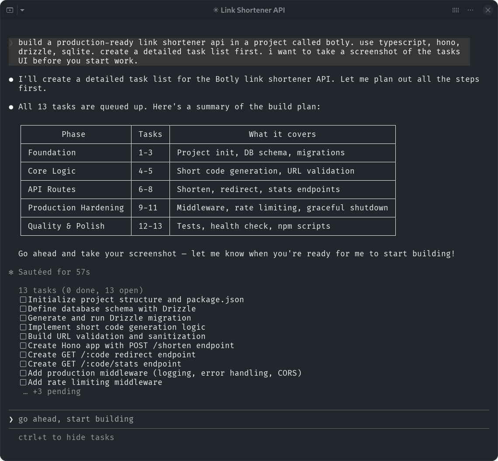

# Context Management

Every new session starts from scratch. The agent doesn't know what it built yesterday, what decisions were made, or what's left to do. Steve Yegge calls this the "50 First Dates" problem. Context windows fill up, sessions end, and everything in them disappears.

Memory is really about context management. The context window is everything the agent has in mind while it works. When a session ends, that context is gone. Memory is whatever strategy you use to get the right information back into context when the next session starts. Every tool in this post is a different answer to the same question: what should be in the context window when the agent starts working?

# Project Memory Files

The simplest way to load context into every session. Every time Claude Code starts, it reads a file called `CLAUDE.md` from your project root. Whatever is in that file becomes part of the agent's context before you type your first prompt.

This is where you put things the agent should always know: how to run tests, what frameworks you use, coding conventions, architectural patterns, anything you'd otherwise repeat every session. Run `/init` and Claude will generate one for you based on your codebase, or write it by hand.

```markdown
# Project

Link shortener API. TypeScript, Hono, Drizzle, SQLite.

# Commands

- `npm run dev` starts the dev server
- `npm run test` runs vitest
- `npm run build` compiles TypeScript
- `npm run db:migrate` runs Drizzle migrations

# Conventions

- Use Zod for all input validation
- Return consistent JSON error responses: { error: string, code: number }
- All routes go in src/routes/, services in src/services/
- Tests live next to the code they test: foo.ts → foo.test.ts
```

Keep it short. The whole file goes into the context window every session, so every line competes for attention with the actual work. Practitioners consistently find that lighter files lead to better instruction-following. If your `CLAUDE.md` is over 300 lines, the agent starts ignoring parts of it.

## Per-Directory Memory

Claude Code doesn't just read one `CLAUDE.md`. It discovers them at multiple levels. Starting from your working directory, it walks up toward the filesystem root and loads every `CLAUDE.md` it finds. So in a monorepo, you might have:

```
myproject/
├── CLAUDE.md                # project-wide conventions
├── src/
│   ├── api/
│   │   └── CLAUDE.md        # API-specific patterns
│   ├── frontend/
│   │   └── CLAUDE.md        # React conventions
│   └── shared/
│       └── CLAUDE.md        # shared library rules
└── CLAUDE.local.md          # personal prefs (gitignored)
```

The root file holds what applies everywhere. Test commands, commit conventions, the project's tech stack. The nested files hold what's specific to that part of the codebase. The API `CLAUDE.md` might say "all endpoints return paginated responses using this shape." The frontend one might say "use server components by default, client components only when you need interactivity."

Subdirectory files load on demand. They're not read at startup but get picked up when Claude reads files in that directory during the session. This keeps context lean. The agent only learns about API conventions when it's actually working on API code.

There's also `CLAUDE.local.md` for personal preferences you don't want to commit. Your editor setup, your preferred verbosity level, shortcuts you use. And `~/.claude/CLAUDE.md` for preferences that apply across all your projects.

The hierarchy works well for teams. The root `CLAUDE.md` is shared knowledge everyone agrees on. Nested files are owned by the people who work in that part of the codebase. Personal files stay personal.

# Memory Management Agents

Project memory files are context you curate by hand. A different approach is letting agents curate their own context. Instead of you writing `CLAUDE.md` and hoping it covers the right things, the agent decides what to store and what to forget.

This idea goes by different names. Letta calls it "agentic memory." The research community calls it "self-managed context." Whatever you call it, the core concept is the same: the agent manages what goes into its own context window, not you.

## Letta

[Letta](https://www.letta.com/) (formerly MemGPT) came out of UC Berkeley research and treats the LLM like an operating system managing its own memory. It organizes memory into tiers: core memory that's always in the context window, recall memory for conversation history, and archival memory backed by a vector store for overflow.

The core memory tier uses structured blocks, labeled sections compiled into XML and injected into every prompt:

```xml
<memory_blocks>
  <persona>
    <description>Identity and behavior of this agent</description>
    <metadata>chars_current=128, chars_limit=5000</metadata>
    <value>I am a coding assistant working on a link shortener API.
    I prefer concise solutions and always write tests.</value>
  </persona>
  <project_status>
    <description>Current state of the project</description>
    <metadata>chars_current=95, chars_limit=5000</metadata>
    <value>Auth endpoints done. Rate limiting done. Short code
    generation needs collision handling. Tests at 60% coverage.</value>
  </project_status>
  <decisions>
    <description>Architectural decisions made so far</description>
    <metadata>chars_current=112, chars_limit=5000</metadata>
    <value>Using in-memory rate limiting (no Redis yet). 6-char
    codes with alphanumeric charset. JWT for API key auth.</value>
  </decisions>
</memory_blocks>
```

The agent sees these blocks in every prompt. Each block has a character limit, so the agent has to be selective about what it stores. It summarizes and prioritizes rather than dumping everything into memory. When something ages out of core memory, the agent can push it to archival storage and retrieve it later via search.

In code, you create an agent with its memory blocks and then interact with it through messages:

```python
from letta_client import Letta

client = Letta(api_key=os.getenv("LETTA_API_KEY"))

# create an agent with memory blocks
agent = client.agents.create(
    model="openai/gpt-4o-mini",
    memory_blocks=[
        {"label": "persona", "value": "I am a coding assistant for a link shortener API."},
        {"label": "project_status", "value": "Just started. No code written yet."},
        {"label": "decisions", "value": ""}
    ]
)

# the agent reads and updates its own memory as you talk to it
response = client.agents.messages.create(
    agent_id=agent.id,
    input="Let's use Hono and SQLite. JWT for auth."
)

# you can also update memory blocks directly
client.agents.blocks.update(
    agent_id=agent.id,
    block_label="project_status",
    value="Auth endpoints done. Rate limiting done. Tests at 60%."
)
```

The agent will update its own memory blocks during conversation. Tell it you decided on JWT and it writes that to the decisions block on its own. Next session, those blocks are back in the prompt and the agent remembers.

Blocks can be shared across agents too. Attach the same block to multiple agents and they all see the same state. Update it from one and the others pick up the change.

Letta recently introduced [context repositories](https://www.letta.com/blog/context-repositories) for coding agents, storing memory as files in a git-backed repository. Agents manage memory by editing files, every change gets versioned with a commit, and multiple subagents can work concurrently using git worktrees.

## LangMem

[LangMem](https://langchain-ai.github.io/langmem/) is LangChain's SDK for agent memory. It defines three types: semantic memory (facts about the world), procedural memory (how-to knowledge like patterns, conventions, and lessons learned), and episodic memory (specific past experiences the agent can reference).

It's more of a framework for building memory than a turnkey solution. You define schemas for what to remember and LangMem extracts matching facts from conversations:

```python
from langmem import create_memory_manager
from pydantic import BaseModel, Field

class Episode(BaseModel):
    observation: str = Field(description="What happened")
    action: str = Field(description="What was done")
    result: str = Field(description="Outcome")

manager = create_memory_manager(
    "anthropic:claude-sonnet-4-5-20250929",
    schemas=[Episode],
    enable_inserts=True
)

# extract memories from a conversation
episodes = manager.invoke({"messages": conversation})
```

You decide which memory types your agent needs, how they're stored (vector database, graph, whatever), and how they're retrieved. This makes it flexible but means you're doing more of the wiring yourself.

## Rolling Your Own

You don't need any of these frameworks. The agent-managed memory pattern is simple enough to implement with a vector store and an MCP server.

The idea: give the agent a store it can write memories to and search later. The agent stores decisions, progress, context about the codebase, whatever it needs to remember across sessions. Next session, it searches for what's relevant and loads it into context.

The advantage over files is selectivity. A `PLAN.md` is all or nothing. The agent reads the whole thing or nothing. A vector store lets the agent search by meaning. "What decisions did I make about auth?" returns just the relevant memories, not everything that's ever been stored.

A few vector stores that are easy to get started with:

- [Chroma](https://www.trychroma.com/) runs embedded in Python with no server needed. Good for local, single-agent setups. `pip install chromadb` and you're going.
- [Qdrant](https://qdrant.tech/) runs as a local binary or Docker container. It has an [MCP server](https://github.com/qdrant/mcp-server-qdrant) so agents can search it through tool calls directly.
- [Pinecone](https://www.pinecone.io/) is a hosted service if you don't want to run anything yourself. No infrastructure, just an API key.
- [pgvector](https://github.com/pgvector/pgvector) adds vector search to Postgres. If you already have Postgres, this means one less thing to run.

The setup with any of these is the same. Store memories as text with embeddings. Search by similarity when you need to recall something. Wrap it in an MCP server so the agent can do this through tool calls instead of you reminding it to read a file.

```python
import chromadb

client = chromadb.Client()
memory = client.create_collection("agent_memory")

# store a decision
memory.add(
    documents=["Using JWT for API auth. 6-char alphanumeric short codes."],
    ids=["decision-001"],
    metadatas=[{"project": "shortener", "type": "decision"}]
)

# next session, search by meaning
results = memory.query(
    query_texts=["what auth approach are we using?"],
    n_results=3
)
```

What matters isn't which store you pick. It's the pattern: give the agent a way to read and write its own memory through tool calls, so memory management becomes part of its workflow rather than something you have to remind it to do.

# Plan Memory

Project files and memory agents handle what the agent knows. Plan memory handles what it's doing. Plans, task lists, and progress tracking are all context that changes as work gets done. The challenge is keeping that context accurate across sessions.

## Plan Files

The simplest approach: keep a `PLAN.md` in your repo with a checklist. Tell the agent to read it at the start of each session and update it as it works.

An earlier post in the series, on [structuring work](), covered storing plans as markdown with `- [ ]` checkboxes that cover progress. This approach works across sessions because the file is on disk, not in the context window. Start a new session, tell Claude to read `PLAN.md`, and it picks up where it left off.

Here's what one looks like mid-project:

```markdown
# Plan: Link Shortener API

## Done
- [x] Project setup: Hono, Drizzle, SQLite
- [x] Create links table with short code, target URL, click count
- [x] POST /links endpoint with Zod validation

## In Progress
- [ ] GET /:code redirect endpoint
  - Increment click count on each redirect
  - Return 404 for unknown codes

## TODO
- [ ] GET /links/:id stats endpoint
- [ ] Rate limiting middleware
- [ ] Add tests for all endpoints
```

The tradeoff is discipline. Agents tend to stop updating plan files as they get deep into implementation. After about 50 tool calls, they start forgetting the original goal entirely. This is a known "lost in the middle" effect. Some people set up a Claude Code hook that reminds the agent to check the plan file periodically. Others just re-paste "read PLAN.md and update it" every few prompts.

## Built-In Tasks

Claude Code has its own task system, covered in the [structuring work]() post. When you ask Claude to create a task list, it breaks the plan into discrete tasks and tracks progress as it works. Each task gets its own agent with a clean context window. Tasks can block other tasks, and Claude works through them in order.

This is a step up from plan files because the agent manages the task state itself. You don't have to remind it to update a markdown file. But the tasks only live in the session. When the session ends, the task list is gone. For work that spans multiple sessions, you need something that persists to disk.



## Taskmaster

[Taskmaster](https://github.com/eyaltoledano/claude-task-master) comes from the Cursor and Windsurf world. It's an MCP server that gives agents a structured task management system, a step up from markdown files.

You start by writing a PRD, a product requirements document describing what you want to build. Taskmaster parses it into a structured set of tasks with dependencies, subtasks, and complexity estimates. Tasks live in a `.taskmaster/` directory as JSON files. From there you work through them in your editor's AI chat. Ask "what's the next task?" and it gives you the highest-priority unblocked item.

It's popular because it works with whatever editor and model you're already using. It supports Claude, GPT, Gemini, and others. The MCP integration means tasks show up as tools the agent can call, keeping the task state in sync as work progresses.

Tasks are stored as JSON in `.taskmaster/tasks/` with dependencies, status, and test strategies:

```json
{
  "tasks": [
    {
      "id": 1,
      "title": "Setup Express Server",
      "status": "done",
      "dependencies": [],
      "priority": "high",
      "details": "Create Express app with CORS and error handling",
      "testStrategy": "Verify health check endpoint responds"
    },
    {
      "id": 2,
      "title": "Create User Authentication",
      "status": "pending",
      "dependencies": [1],
      "priority": "high",
      "details": "JWT-based login and register endpoints",
      "testStrategy": "Test login with valid/invalid credentials"
    }
  ]
}
```

The CLI is straightforward:

```shell
# generate tasks from a PRD
task-master parse-prd your-prd.txt

# view all tasks
task-master list

# what should I work on?
task-master next

# task id 1 is done
task-master set-status --id=1 --status=done

# break a task into subtasks
task-master expand --id=2 --num=3
```

Where Taskmaster differs from plan files is enforcement. The task state lives in structured JSON, not markdown that the agent might forget to update. Dependencies are tracked explicitly. A task can't start until its blockers are resolved. And because it's an MCP server, the agent interacts with it through tool calls rather than file reads, which keeps the loop tighter.

## Beads

[Beads](https://github.com/steveyegge/beads) is the most opinionated tool here. Steve Yegge built it after spending most of 2025 on agent orchestrators. Four of them, three of which failed. Beads is what survived.

The core argument: agents can't manage work with markdown files. They write a plan in `TODO.md`, start coding, and never update it. Over a long session the plan and the actual state of the project diverge completely. The markdown rots. Structured JSON (like Taskmaster) is better, but beads goes further with a full dependency graph.

Beads replaces plans with a git-backed graph of issues. Each bead is a structured record stored as JSONL in a `.beads/` directory. They have hash-based IDs like `bd-a1b2` (designed to avoid merge conflicts when multiple agents work in parallel), dependency tracking between tasks, and a proper state machine for status. Agents can query which tasks are ready, claim work atomically, and update status as they go.

The CLI is how agents interact with it:

```shell
# initialize beads in a repo
bd init

# create a task
bd create "Add search feature" -p 2 -t feature

# show unblocked tasks
bd ready

# claim a task
bd update bd-a1b2 --claim

# mark task finished
bd close bd-a1b2 --reason "Implemented"
```

Each bead is a JSONL record:

```json
{
  "id": "bd-kwro",
  "title": "Add search feature",
  "status": "open",
  "priority": 2,
  "issue_type": "feature",
  "dependencies": [
    {
      "depends_on_id": "bd-f14c",
      "type": "blocks"
    }
  ]
}
```

The dependency graph is the key idea. Instead of a flat list, beads know which tasks block other tasks. An agent can run `bd ready` and get back only the tasks whose dependencies are satisfied. Agents don't have to reason about ordering. The graph handles it.

Beads is built for multi-agent workflows. All worktrees in a repo share the same `.beads` database in the main repository, so multiple agents in different worktrees see the same task graph. One agent finishes a task, marks it done, and the others immediately know.

# Curating Your Context

All of this is about getting the right information into the context window at the right time. The approaches differ in who does the curating and how much structure they need.

**Project memory files** are context you write once and load every session. Every project should have a `CLAUDE.md`. Add per-directory files when different parts of the codebase need different context.

**Memory management agents** let the agent curate its own context. Letta puts structured blocks in the context window. LangMem gives you a framework to build your own. Or roll your own with a vector store and an MCP server.

**Plan memory** is context that changes as work gets done. Start with a `PLAN.md` and some discipline. Built-in tasks are a step up but don't survive sessions. Taskmaster adds persistence through an MCP server. Beads goes further with a dependency graph built for multi-agent projects.

Start with the simplest thing that fits your work. You can always add more structure later.
