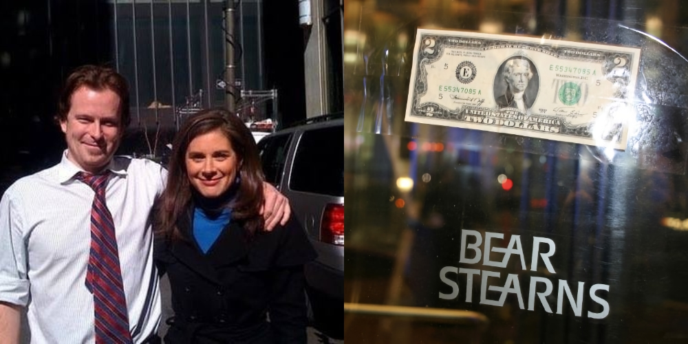
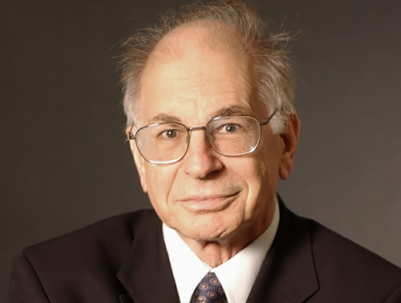

kladjf

## Crash, Crash, Crash

The first time I experienced a financial panic was in the early 90s, when the S&L crisis wrecked a fintech company my dad was building. The second one, the dot com crash, happened as I was finishing a computer science degree. I loved building web things, but web jobs were hard to find, so I turned towards finance and eventually joined Bear Stearns. They were the first bank to collapse in the 2008, giving me my third recession. 

The first panic exists as memories of never having money to do the things my friends were doing. I got into computers just in time to witness a lot of the dot com boom ramping up. I wanted to talk about computers all the time, so I would talk to anyone who had opinions about the Internet, so it didn't take _that_ long to realize people didn't actually know why any particular businesses would succeed or fail. They cared more about not missing out on stocks that were _definitely gonna go up soon_. I was all in on Linux and I loved the web, so I figured I'd get a computer science degree only to graduate into the ashes of the dot com collapse. As I reckoned with what that meant, I eventually thought, "_maybe wall st would be more stable for now._"

I moved to SF in 2005 to work for a small software company that sold trading systems to Wall St banks. It would be a little while before I understood what a derivative is. After showing my team's recent work to some of the folks in sales, I became friends with a sales trainee named Ulysses. He had gotten an MBA and studied investing enough to believe that it's possible to make wild money right now. He explained that there is a place called Countrywide that didn't care if you had income, a job, or even any assets, they would say yes and give you the loan. It made no sense to me why a bank would do that, so Ulysses assured me that home prices never go down. He knew some folks who were flipping 5 or 6 at a time. I told him I had heard people talk like that before.

I moved to NYC late 2006 to work for Bear Stearns. I wanted to find my Wall St and here I had done it. Just in time for it to collapse two years later. In SF I worked on foreign exchange software, so I was delightfully naive about anything else banks do to make money, but I was eager to catch up.

By 2007 I had learned enough about their technology that I switched to learning what the other stuff is, like credit default swaps, collateralized debt obligations, etc. I thought about Ulysses's friends immediately when I learned a credit default swap is insurance for bonds, and that mortgages are a type of bond. I started with huge questions, trying to a some sese of scope. _If you can buy insurance for mortgages, does that mean you can known the total size of the mortgage industry?_ You can, and the answer was $11T, according to folks at Bear. _Can you know the total value of all insurance?_ You can, and I was told it was $66T. _Wait, why is the insurance industry 6x bigger than the stuff being insured?_ Bear collapsed in March of 2008 and JPMorgan bought the company wholesale for $2 a share.

I read When Genius Failed, by Roger Lowenstein, the summer before Bear crashed. It's about the rise & catastrophic failure of a hedge fund called Long Term Capital Management. They were famous for using extreme amounts of leverage backed by two Nobel laureates. For Wall St, it is a classic story about hubris and collapse that concludes with 14 banks coming together to bail them out. Could've been 15 banks, but Bear said _fuck you_ instead and didn't give a cent. I was floored by that when I first read it, and I thought about it again as rumors got going that Deutsche and Goldman were planning to take us down.

I got to work early enough to see $2 bills taped to some of the windows as I walked up the following monday. It was so absurdly perfect for that moment. No one knew for sure who did it. We all assumed it was traders from JPM, who were next door. On the way back from lunch, I ran into [Erin Burnett](https://en.wikipedia.org/wiki/Erin_Burnett) outside the building, looking for information.

The USGov didn't want the state of the bank to change, but we were still supposed to go into work. We weren't supposed to do anything, since that'd modify the state of the bank, but we still had to go in. In effect, we had just experienced a historic event and now we had nothing but time to hang out and discuss what it all meant. Everyone inside was so confident we'd have _runaway inflation_ and that _Ben Bernanke didn't know what he was doing_. Their confidence seemed so ridiculous to me. They literally _just_ crashed a legendary Wall St bank and here they were, talking like they're still the experts. Cmon.

## Scenes and Networks

I had no idea what I was going to do with my career after Bear, but I knew it wouldn't be finance. I looked out at NYC and figured there had to be artsy hacker types around here somewhere, just had to find them. I started by building things that might catch people's attention. That's what I had done with every band I had up to this point and that seemed to work. Music scenes worked better when everyone helped each other out, so I figured I'd write open source that solved problems people actually have. If anyone was interested in getting their team's opinion about a project, I'd offer to give a talk to the team in exchange for lunch with everyone.

I loved the idea of building new things entirely from scratch. Felt like a small group of people writing music together. By sheer luck the first company I worked for was funded by Andy Weissman and Bijan Sabet, two VCs that were influential then and still are today. I was the fourth employee. I had never met VCs before but they invited me to the monthly investor meetings. I was still skeptical of investors, but these guys loved music and I was into that.

### Andy Weissman

I became friends with Andy later when I worked for another of his startups. He walked in one day, remembered me, and came by my desk to ask what I had been listening to lately. I was coding, so I had dnb on, but he said Fugazi, and that kind of broke my brain a little bit. I loved Fugazi but they are a band that wouldn't even sell shirts because they were idealistic about not being a merchandise company. Seemed kinda antithetical to anyone with _capitalist_ in their job title. And yet, Andy was at the White House when Fugazi played there.



After maybe 6 months of talking about music and what it means to be in a scene or to have an audience, I remember that he's a VC. I start by telling him about the way it seemed like all the investors I had ever met seemed to have no idea what they were doing, but that I liked how that seemed to be an open assumption for startup investors. Early investors would fund people that hadn't really done anything yet, for example. I then asked him how _he_ made investment decisions and if it ever felt like he was just guessing.

At some point in the conversation that followed he asked me, "_why do people go to Grateful Dead shows?_" I thought it was hilarious to respond, "_well it ain't because of the music!_", but then Andy said that was right. _Uhh, wait. I wasn't expecting that._ I paused to consider what he meant and I realized deadheads were doing what I had always done in music scenes. We were going to shows for the music and to be with our people. Where else would you find a concentration of people who are weird the same way you are?

### Network Effects

I didn't realize it, but while we were discussing music, scenes, audiences, etc, we were _also_ discussing the kinds of businesses he invested in. To him, building a successful business online means you build a scene. You gotta make something compelling enough that people gather for it. Then it should be possible for people to stay in touch and follow each other, etc. Just like starting a band and getting anyone to care about it. He summarized the investment thesis for USV, where he worked, as _large networks of engaged users, differentiated by user experience, and defensible through network effects_. No one said _moat_ at the time, but USV saw network effects as a moat and they looked for companies that were based on good network design.

Each company had an atomic unit, the thing people came together for. It was usually a simple idea too, like a store, a song, a project, and then you add a bunch of mechanisms for everyone to find and interact with each other. There's usually two-sides, like a blog and readers, a project and backers, a store and customers, but everyone is also part of a larger network that gets better as more people join it. Why do people sell on Etsy? Because people buy there. Why do people buy on Etsy? Because people sell there.

It seems quaint now, but network effects weren't common knowledge back then. It was scene knowledge, and USV were the label behind most of the best bands. Consider that all of these companies were a growing network of highly engaged users, where people with special interests to find other people with the same interests: Tumblr, Kickstarter, Foursquare, Etsy, Soundcloud, Twitter, Zynga, Stack Exchange. They had a smart strategy for identifying good companies to invest in and they're made their money by investing in them before any of the growth took place.

I was convinced all investors were rich idiots up to that point. I was wrong about that.

## Thinking About Thinking

I came across Tren Griffin's twitter feed around 2013 because he was ripping on Wall St in hilariously smart ways. He'd joke by mocking the idea anyone could actually pick a successful stock. That cut right to the point, that folks kept wrecking the economy because they think they can predict the future. He seemed to have a successful career investing for Microsoft and making deals with billionaire John Malone and yet, he thought everyone on Wall St were assholes just as much as I did.

That's Tren. He looks like an MBA in human form, and yet he had me cackling whenever he mocked Wall St. I couldn't get enough. His humor came from believing humans constantly make decisions that don't make sense. His feed was a steady flow of examples of Wall St announcing decisions that don't make sense followed by a thread of his analysis.

### Charlie Munger

There's a point when Tren announces he's going to write a book about Charlie Munger. He posts a lot about Munger during this phase and following along was one of the most educational experiences of my life. Tren could speak in simple terms about what it means to make investments based on most people being wrong about something. I was used to being an oddball in life and accepted that years ago, but Tren was now making the case that you can't be a good investor without being an oddball. Paraphrasing Howard Marks, from a [1993 memo](https://www.oaktreecapital.com/docs/default-source/memos/1993-02-15-the-value-of-predictions-or-where-39-d-all-this-rain-come-from.pdf): _It's not enough to be correct if the consensus forecast is also correct. For superior performance you must take a nonconsensus position that is correct when the consensus forecast is wrong._

His book on Munger was fantastic. It was an exploration of ways to consider a business so you could find undervalued businesses. The key to performance was temperament and thinking rationally. Intelligence turned out to not be necessary. The idea is to find great assets that are mispriced in the current moment. You don't predict the future, you differences between what a company is worth, measure the distance between that and the current price, and invest if the gap is big enough. If the price is very wrong, you have a large _margin of safety_, eg how tolerant your investment is to mistakes in your analysis. Can you be wrong about half your reasons for some investment and still get a great return? It then covered the types of traits a business should have to be able to defend itself from competitors: the traits necessary for moats. The way Tren spoke about moats reminded me of Andy talking about network effects. Network effects are a type of moat.

### Mauboussin

Whenever Tren mentioned moats, he would mention Michael Mauboussin's paper, Measuring the Moat, so I read Mauboussin too. One of his books in particular, The Success Equation, had a powerful effect on how I thought about things. He used statistics to understand when changes in performance come from skill improving, changing base rates, or from a lucky streak that will come to an end as performance goes back to what it used to be.

He wrote about statistical outcomes in a way that felt personal. On trying novel ideas that need luck to succeed he said you face two outcomes: people that think _this_ if it's successful or _that_ if it isn't. If your idea fails, the most likely outcome, others will doubt you and question why you didnt take the tried & true path. If the idea succeeds instead, you are seen as a rare genius that saw something no one else could. Either outcome seems unwarranted when you consider that luck probably made the decision.

This book is where Mauboussin explains one of my favorite of his ideas, the _Paradox of Skill_. The paradox says that in activities where skill and luck define outcomes, as skill improves, luck becomes more important in determining outcomes. This is because everyone's gotten better, and as a result, the standard deviation of skill has actually narrowed. Any advantage that may have existed for people with higher skill has diminished enough to have minimal influence over the outcome. He then offered strategy for playing when luck dominates or when skill dominates. If your competition is of comparable skill or better, add randomness somehow. Do things they don't expect. Throw them off and force them to make mistakes as they scramble to respond. If your competition is less skilled, simply the game into plays focused on your skill.

### Thinking Too Fast

After publishing the book on Munger, Tren switched to thinkers that had figured out how to find advantages using statistical analysis in a field that typically made decisions based on intuition and tradition instead. Those fields were fertile ground for bias and judgement errors.

Annie Duke was an academic psychologist, on her way to a PhD, when her career as a poker player took off. She realized most players lost because of avoidable errors, rather than playing heroic hands unsuccessfully, an assumption at the time. She then tracked how often people bluffed, chased losses, played too many hands, etc. If she could play more rationally than that, making fewer mistakes, she could win a lot of money without taking on the same risk as her opponents.

Robert Cialdini used the same principle, but instead of guarding against bias, he studied how to leverage it as a car calesman, a fundraiser, and a telemarketer. He took jobs where the goal is to have people say _yes_ to some offer, eg. cognitive warfare. One of my favorite stories is when a cute woman gets an middle aged man to boast about how often he goes out to dinner. The idea is to get them to articulate something excessive and then use that to sell them something. If they claim they go out to dinner 3 times a week, paying for a savings card that gives a 20% discount on the third meal for 3 months should be a no-brainer. That is, unless they lied and the card is actually a waste of money. Cialdini tells most people will buy the card so they don't have to admit they lied. That's what I meant by cognitive warfare.

When Michael Lewis wrote Money Ball, he told the story of using statistical analysis to select overlooked players, ignored by other teams, that can be recruited to convert the failing Oakland A's into a winning team. The idea here is that the other teams had cognitive biases that caused them to overlook valuable traits, like how often they got on base or how often they successfully stole a base. The strategy worked so well that it'd eventually become a movie with Brad Pitt.

## The Science of Judgement Errors

Michael Lewis popped up again in 2016. He was doing the podcasts thing to promote his new book, The Undoing Project. Fans of Money Ball had apparently told him many times that Money Ball was _actually_ about Danny Kahneman's work. Lewis looked into it and became so fascinated by Danny's life that he wrote this book. There was a point in the episode where he mentioned that Kahneman won a nobel prize for economics, even though he was a psychologist and not an economist, and that was that. I read the book. I read it again a few years later too.

The Undoing Project was such an interesting book for me. Danny's questions about how humans think took anything I had ever thought to a new level. They were a framework for understanding where our mistakes in thinking came from. It gave me a way to understand what was happening in people's minds during each of the 3 crashes I had experienced in life.

Would you believe that man doesn't trust his own mind? He had no confidence in his own ability to reason about anything. Would you also believe he's one of the most exceptional minds ever? Consider what he says in the following quotation.

> The confidence people have in their beliefs is not a measure of the quality of evidence but of the coherence of the story the mind has managed to construct.
> 
> – Daniel Kahneman

### Early Life

Kahneman was from a wealthy Jewish family living in Paris as WW2 was ramping up. The Nazis invaded in 1940 and his parents disagreed about how to react. His mom felt strongly that they should leave, but his dad wasn't yet ready to give up the life they'd built. Danny, who was 6 or 7 at the time, realized that one of them must be wrong and he wondered why they were wrong. It didn't make sense to him that two people could look at the same thing and draw very different conclusions about what they saw. His father was soon picked up in the first Nazi round up of Jewish people since the occupation began. He was freed later when the founder of L'Oréal, his father's employer, intervened. The family escapes to rural France where they lived in a barn, yet dressed like a family of means. The town accepted them as another well off family because it didn't know they were actually Jewish and hiding in a barn. They had no reason to know and accepted appearances for what they were. The family stayed on the run until they moved to Mandatory Palestine, which would become Israel two months later.

Danny is drafted into the Israeli army when he was 21, after getting a psychology degree from Hewbrew University of Jerusalem. He becomes one of the only psychologists in the army and they wanted him to help evaluate new recruits. They were using a method copied from the British, who got it from German military pscyhology. One of the tests was to put eight strangers together, without putting anyone in charge, and tell them they have to figure out how to get it over a six-foot wall without either them or the pole touching the wall. The evaluators would watch and see who took command, who had ideas, who quit, who got bossy when things stalled, who folded under pressure, and they'd finish the evaluation with confident impressions of performance for each recruit. Then he checked those predictions against how the men actually performed in officer training school. People written off turned out to do well, leaders turned out to quit easily, and generally didn't perform better than flipping a coin.

In his words, the biggest issue was that "_people are less consistent across situations than we think_". The person who steps up for the telephone pole might not be the person who leads well through months of training or real command. Second issue, the strength of an impression was influenced by how vivid it was. Seeing someone yelled at, not giving up, etc, was overriding anything more objective, like a score, and interviewers end up forming narratives about who the recruits are. It _feels_ true even if it doesn't predict anything. And the third issue came the way an early impression colors how interviewers interpreted the recruit from that point on. A single impression would spread across the whole judgement. At just 21 years old, Danny showed that thin evidence, from the wrong situation, became an overconfident story.

The army then assigned him the task of making a better system. He believed human judgement is where things kept going wrong, so the new design would have almost no judgement in it. Interviewers were instructed to avoid behaviors that might cause impressions of the recruit to form in their minds, causing more judgement errors. The process was built around factual questions about a recruit's life that could be used to score them trait by trait. The final decision was then made by summing up those scores. The new simplicity felt dehumanizing for interviewers, who made it known they didn't want to be robots, so Danny asked them to close their eyes and give a single gut rating score and agreed to take it into account. The new checklist oriented system beat the old system so decisively that the army used it, more or less unchanged, for decades. Danny compared the gut ratings of the interviewers and showed that it was pretty accurate too, it just had to come _after_ considering the facts.

All of this is just chapter 2 of Lewis's book about Danny. After leaving the army he spends the rest of his life probing the human mind, using statistics to find its weaknesses. I highly recommend reading it.

### Cognitive Biases

Danny and Amos Tversky were in the psychology department at Hebrew University of Jerusalem. Danny invited Amos to speak at his graduate seminar in 1969. Amos's talk described his group's work modeling humans as roughly Bayesian thinkers, but that the update process for beliefs moves too slowly. Danny didn't accept any of it and explained why to Amos in a way that made him pause. He kept thinking about it and, before long, he and Danny create a framework for measuring the mistakes in judgement that emerge specifically because humans are _not_ bayesian thinkers.

One of the most interesting things about cognitive biases is that people don't know they have them. We usually believe we're making rational, informed decisions, but that isn't what actually happens. Spend enough time reading about cognitive biases and you'll find it becomes difficult to take anyone seriously if they seem confident. It's just too easy to be wrong and have no idea.
