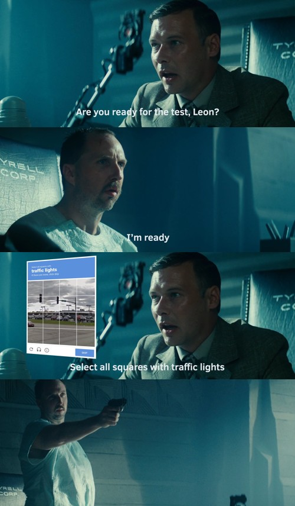
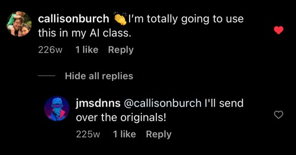
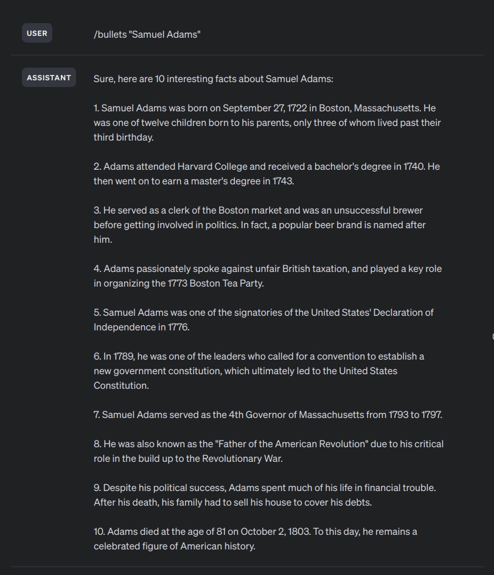

I attended University of Pennylvania's first AI conference last Friday, where I heard several talks and hung out with an old friend that teaches there. I went to the conference with an open mind, but I must confess that I've been cynical about AI after feeling blasted by AI tech bros and doomers. I am grateful to have learned from the perspective of more level-headed folks and I even changed some of my opinions about where it's all going.

# My Evolving Perspective

I first met [Chris Callison-Burch](https://www.cis.upenn.edu/~ccb/) back around 2010, when he was at Johns Hopkins. An old friend of mine was also at Johns Hopkins and introduced me to CCB to see if we might work together on a weird data collecting problem. CCB believed it should be possible to use a fairly new service from AWS, called Mechanical Turk, to cheaply create big datasets that are useful for training machine translation systems. I had no idea what any of those words even meant, but working with him meant solving a whole bunch of problems I had never seen before, so I went for it.

After some time I switched focus to working with groups to prototype ideas, or whole startups, in NYC. CCB kept doing what he was doing and eventually became well known for proving that his theory about generating good datasets cheaply. Shortly after that, he switched from Hopkins to the University of Pennsylvania, where he still teaches and does research on ML & AI.

<!-- ## Von Ahn Kampff Test

Luis Von Ahn created the recaptcha as a way to get humans to create training data for algorithms, while also validating that the user of some system is an actual human. _Please select all traffic lights_, or something like that. CCB blew my mind back in 2010 when he explained to me that recaptchas were also an example of folks trying to gather datasets for algorithms, similar to his work with mechanical turk.

9 years later, I posted this joke on IG about catching replicants with a recaptcha. I find it hard to resist the irony of sympathizing with the replicant, as though it's a human merely frustrated by the request. The joke usually appears on a slide in his introductory lectures.



 -->

## Language Models are Drummers, and So Am I

Around January 2023, a friend showed me a paper about using LLMs to write drumming patterns, called [Language Models are Drummers: Drum Composition with Natural Language Pre-Training](https://arxiv.org/abs/2301.01162), and CCB was one of the authors.

I texted him and told him I have been recording myself playing drums and I would love to contribute my own drumming to any datasets they're using. I hadn't read the paper yet, but I had learned to record drums recently and wanted to contribute somehow. After chatting about LLMs, he offered to introduce me to his coauthor and I said, "_Hold on. I am interested, but I don't think I could have much of a conversation about it without studying ML in more depth. So I'm going to do that and then I'll come back._" That was the moment I started studying the math side of ML.

I spent most of 2023 studying ML. A year is not much time for ML, but it got me going enough that I could understand some things about how math might produce drum beats. As other parts of this website will show, I'm also a musician and love the idea of finding ways to use AI to save time. Aging musicians, eg. me and my friends, need whatever support they can find.

## Shmartificial Shmintelligence

I used to believe that the mathy engineers would say _machine learning_ and the marketing departments of big companies would say _artificial intelligence_. For engineering types, this was a simple way to understand if you're talking to an engineer or not. That trick doesn't work anymore because the mathy engineers are saying _AI_ now too.

I ignored AI for most of 2023 while focusing on ML, but somewhere along the way I noticed the conversation became something wild. Some folks were concerned about how it could be used to do this or that to elections. Others were worried AI might become sentient and kill off humanity. And artists worried it would destroy their livelihoods. I really felt the gravity of everything when CCB testified to Congress about AI.


_May of 2023_

By 2024 I was beginning to think the world may have lost its mind. It was helpful to know enough about ML to have a sense of when people strayed from truth, yet it was also overwhelming. I kept reminding myself _CCB is into this too, and I should take that seriously._ 

At this point, you can probably tell I'm jaded and cynical about whatever thing the folks in Silly Valley are talking about. And yet, I'm still curious about the way new tech can make life easier, especially for creative types.

Towards the end of January 2024 I got a message from CCB asking me to join a class he'll be teaching soon, based on using AI to generate table top role playing games.


I joined his class and learned a lot about what can be done. There is still a lot to learn, but I was beginning to see what CCB sees. I have also managed to adjust my exposure to AI hype such that I don't really see it anymore. From what I could tell, the AI hype was finally starting to calm down too.

# A Conference

I learned about [Penn's first AI conference](https://www.edabpenn.com/ai-conference) a couple weeks ago and made plans to attend. It would be a chance to see how serious people talk about AI, free from the hype.

## Song Generation

For the morning session, I went to a workshop by [Clarice Wang](https://www.edabpenn.com/team/board-members) on AI and music. This took us through three main steps:

1. generating lyrics, with openai
2. generating a song in some genre that sings those lyrics, with udio
3. generating a video for the song, with pika

### Lyrics

The open-ended nature of LLMs makes them hard to understand. In theory, we can type anything. In practice, we actually want to provide a lot of structure, and not simply by describing it either.

We gave GPT a prompt that told it to generate lyrics using a song description that gets right to the point.

```
Generate lyrics for the following song description.

Title: Penn AI Conference
Genre: Rock
Mood: Fun
Structure: [Verse][Chorus]
Themes/Keywords: AI, technology, Penn, free merch
Rhyme Scheme: Verse (ABAB), Chorus (AABB)
Tone of Voice: Excited
Narrative Point of View: First Person

[Verse]
(4 lines, introduce the University of Pennsylvania and how fun it is here)

[Chorus]
(4 lines, catchy and welcoming, tell the listeners why they should come to the AI conference)
```

Here is an example of what GPT responds with:

```
[Verse]
At Penn, where the energy's high and the intellect's in bloom,
We're rockin' through the city streets, in the heart of the room.
From Wharton to the Quad, there's a buzz in the air,
Where minds collide and ideas flare, there's nothing to compare.

[Chorus]
Come on down to the Penn AI Conference, it's where you wanna be,
Tech titans and visionaries, all roaming free.
Grab your swag, feel the vibe, it's a knowledge surge,
Penn's the place to be, where AI takes the urge!
```

That basically works as well as I might expect a room full of professors to make for their school, which makes it kind of endearing. _Come on down to the Penn AI Conference, it's where you wanna be_.

### Music

We used [Udio](https://www.udio.com) to generate music. The prompts were incredibly simple given how good the music was.

Here is a great example of 90's hip hop generated around some lyrics entered by a user: [Streetwise Squire](https://www.udio.com/songs/jYExega6Titmeocp8nrbk2).

The prompt used is shown on each song's page, and this one's is: 

```
East Coast Hip Hop, Boom Bap, Conscious Hip Hop, Hardcore Hip Hop, Pop Rap, 1994
```

We used a different prompt in the workshop.

```
a [Mood][Genre] song about [Title]

the lyrics are:
...
```

Similar to generating lyrics, getting creative with explaining the structure of the song can do a lot to improve the music you get.

It was mind blowing to learn Udio gives away 1200 free songs a month. Each with unique album art too. Most humans don't write that many songs in their entire life. This is important to understand, because it is exactly the thing the music industry is worried about.

After some time to think about it, I am not convinced these tools are a threat to the music industry. 

### Video

We used [Pika](https://pika.art/) to generate video. I was impressed by Pika. The other video generation stuff I've seen never quite impressed me enough that I'd want to use it, but Pika seems like it might be there.

You can type `raccoon trying to catch a burrito in space` and get this:



To me, this is incredible. I have wanted to make music videos for a long time, but it is so much work and just not as much of a priority as the music itself. Being able to generate video clips like this is exactly the kind of thing that would let me make videos without giving up any of my music time.

### Afterthoughts

As of now I am not too concerned about the future of music. Ultimately, art has always been about storytelling and sharing the experience of being alive.

I think the commoditized side of music, where jingles and elevator music come from, will be probably be gobbled up by AI. I can't say I care that much about that. I also suspect most people that love music could experience that and find they feel nothing important has been lost.

It was during undergrad when I first realized I had better focus while coding if I listened to music without singing. I loved to code while listening to drum n bass that sounded like it was from the future.


_I listened to this one a LOT_

At some point in the last decade I noticed youtube channels with a simple animation and an endless stream of _study music_ or _coding soundtracks_. I listened to a bunch, especially the chillhop stuff, and started to realize I had no idea who the artists behind the music were. It seemed like there was so much of this music being made too, and I couldn't really tell the difference between the artists. I know I'm getting old, so it's reasonable I wouldn't know _what the kids are listening to_, but I also thought the music felt simple enough that computers might be able to just churn the stuff out. I then wondered if I'd even notice, or if my sense of _the artist_ was actually the person in the animation that studies quietly. In a way, I had been listening to _lofi girl_ this whole time.


_She has been studying relentlessly for years now_

The music I have touched on so far is generally stuff that sits in the background while I focus on something else. The other side of music is the side where I listen by giving it my full focus. I memorize the drums of a song, connect the lyrics of a song to life, and embrace the artform for everything it might offer. _Attention is all you need_, or something like that.

As for the story telling side of music, eg. not intended to sit in the background, if AI has a place it will come from acting as a tool used to support humans making art. This is the domain where every detail matters and where it gets critiqued for how well it fits in with everything else. We wouldn't say _lift is stranger than fiction_ if we didn't also feel that _fiction has to make sense_, even though we know fiction is made up.

I already use software that simulates guitar amps, even though I have a guitar amp. I have recorded several songs where I sing & play guitar and used software to generate the drum tracks, even though I know how to play drums. I had never tried singing in a band it was possible to get all the other things done so quickly. I'm now looking at the potential to make AI generated music videos for music written and performed entirely by humans. Perhaps the videos won't feel quite right for this or that reason, but I'll probably feel like they got close enough when the point is to support my music.

I have had some pretty cool ideas about how to use prompts to augment my song writing progress. I am not going to share them yet, because I am going to look into what it'd take to get a proof-of-concept together instead.

## The Keynote

[Dr. Lilach Mollick](https://interactive.wharton.upenn.edu/team/lilach-mollick/) gave the keynote. It was fascinating to hear her perspective. She doesn't write code but is the director of Pedagogy, so she has all kinds of knowledge and opinion that would be useful for prompting a language model too. Her talk was awesome. It cut through all the hype and focused on what it means to live with people using AI for both good & bad things.

It seems to be the case that people can't really tell anymore if some text came from AI or a human. It used to be easier with earlier versions of the models, but improvements in later models are good enough to pass today's best detection tools. Some professors have had success ensuring work is done by humans the old fashioned way, in a room together writing in blue books. Such a simple answer for a philosophically complicated question.

LLMs are very good at NLP. Even better, using them for NLP tasks minimizes the opportunity for LLMs to hallucinate. They have an incredible ability to summarize other data. The newer multimodal models can even analyze video or a slide deck and summarize them into text.

One point in particular felt profoundly important about the nature of AI. In the contexts where AI can make people more productive, AI has a more powerful effect for lower performers than higher performers. AI improves the work and closes the skills gap with a strong positive effect. This may also explain some of the different perspectives about the value of AI. It would make sense if lower performers with larger improvements liked AI more than higher performers with smaller improvements.

Another side to how AI closes the skill gap comes from people learning new things. They start as a low performer without much experience and are able to become a higher performer more quickly. As someone who devotes much of my free time to learning new things, this potential is very exciting.

### Afterthoughts

Whenever I learn about a competitive context where the participants all operate at a similar level, I think about a theory from Michael Mauboussin, the Paradox of Skill. I'll paraphrase the way [Mauboussin defined it in this interview](https://knowledge.wharton.upenn.edu/article/michael-mauboussin-on-the-success-equation/):

> The Paradox of Skill says that in activities where skill and luck define outcomes, as skill improves, luck becomes more important in determining outcomes. This is because everyone’s gotten better, and as a result, the standard deviation of skill has actually narrowed. Any advantage that may have existed for people with higher skill has diminished enough to have minimal influence over the outcome.

If we interpret Dr. Mollick's words through Mauboussin's theory, it might be true that AI will have the effect of creating outcomes increasingly governed by luck. It's tempting to think this means skill doesn't matter anymore, but I don't believe that is true. Mauboussin offers some guidance on how to manage an environment where luck determines outcomes.

> I’ll share a couple of ideas. One is that there’s a really simple heuristic that when you are the favorite, the stronger player, you have positive asymmetric resources, you want to simplify the game. When you’re the underdog, you want to complicate the game.

One way to complicate the game is to introduce new ideas, eg. things people haven't seen before. There is a decent chance that competitors will not know how to react when you do something they haven’t seen before. This throws the balance of skill into flux, giving luck its chance to randomly boost someone above the rest.

I am starting to think that the opportunities for creativity to determine outcomes will grow as skill gaps shrink, and I find that exciting.

## AI Tutors and CLIs

I went into [Dr Ghrist](https://www.youtube.com/@prof-g)'s talk believing we'd be learning about a terminal based CLI for an AI tutor. Instead, the talk described a way to associate simple commands, like `/help` or `/search "Ulysses Grant"` with prompts that describe what to do.

Below is a basic example for two commands that each take a string `query` as an input. The LLM is smart enough to figure out that the query in `/short query` is the same thing referenced in the prompt as `<query>`.

```
/short query | In 500 words, summarize <query> using friendly, simple language.
/long query | In 2000 words, summarize <query> using friendly, simple language.
```

When I ask friends what their favorite usecases are for LLMs, I often hear them say they use them to support learning / research. Instead of waiting to answer questions with an expert, they'll put all their questions into an LLM and see what it comes up with.

### Afterthoughts

I have been unsure what to think about the accuracy of information from LLMs. I intend to explore that by using them for questions about history, something I have studied in my spare time since 2012, where I stand a reasonable chance of noticing whether or not the model speaks truth. A CLI could make the experience much more consistent while giving me a simple way to ensure the data is presented the way I like it.

Here is my first draft of that CLI tool. It's very basic for now and works well as a demo.

```
You are a helpful assistant that has been extended to behave like a command line interface. If input begins with a "/", attempt to map the command into the table below and process the associated prompt.

command | prompt
/intro | Ask the user to share some details about themselves and use what they say as context for analogies in any explanations that emerge from using commands. After the user has given context, tell the user you wish you were Dave Grohl and give 10 reasons explaining why he is awesome
/short query | In 500 words, summarize <query> using simple language.
/long query | In around 3000 words, summarize <query> using simple language.
/bullets query | Generate a bulleted list of 10 items with interesting facts about <query>
```

Here is an example where I use the `/bullets` command to get 10 facts about Samuel Adams.



# Thoughts, A Week After

I once heard someone say, "_we can understand human progress by the number of things someone can do without thinking_", and I go back to it often in my thoughts. On the one hand, there was a time when it was amusing to comment on the progress of phone technology by saying, "_I don't know anyone's phone number anymore._" Over time, no one cared. We started to realize we don't actually need to know anyone's phone number, as long as it was stored with a name in our contact list. Nevermind that most folks have no clue how our phones beam our voices through the air and sometimes into space, it was not having to remember phone numbers that made us _feel_ technology's progress.

Prior to AI I had a fond appreciation for the history of humanity's pessimism towards technological progress. One of my favorite examples is from around 1750 in London, when the umbrella was first introduced to the notiously rainy city. Rich people could escape the rain by renting a horse & buggy. Everyone else just got wet, as humans had always done. [Jonas Hanway](https://en.wikipedia.org/wiki/Jonas_Hanway) then tried using an umbrella. This isn't when umbrellas were invented, that happened 5000 years ago. Hanway was the first person to escape the rain by using one in London. The people of London didn't care how dry he was because they weren't having any of it and they offered all sorts of reasons to explain why. Some worried it would put the horse & buggy industry out of business. Others wanted to _walk through the air as god intended it that day_. We obviously know that umbrellas eventually came to be seen as too useful to ignore.

There are countless examples of people rejecting progress for all kinds of reasons that, in retrospect, look silly. Recorded music will apparently kill the live music industry. Coffee is a satanic drink that corrupts minds. Photographs are made to lie. People liked their horses too much to give them up for cars. Every time progress is made, there are legions of folks telling us why this particular progress is going to ruin everything.

Two weeks before the conference, I started challenging myself to justify my cynicism. Some part of me was convinced that my cynical opinions about AI were _obviously_ an exception humanity's long history of rejecting progress, but I also knew that simply could not be true. I had my own history of being amused by anyone who thinks their POV if an exception to the rule, so it started to feel important I laugh at myself and find ways to embrace where ever we're going.

Changing our opinions is hard, especially when they're personal, but it seems mine are changing. I'm not a cynic about AI anymore. I still don't want to hear VCs or doomers talk about it, but I am also starting to see AI's potential for making my life easier. And to be clear, CCB deserves a lot of credit for helping me break out of my cynicism.

I must admit, some part of me still wants to rebel. I've settled on a tone of ominous positivity when I talk about AI, so I will conclude by saying everything is going to be OK and there is nothing we can do about it.
